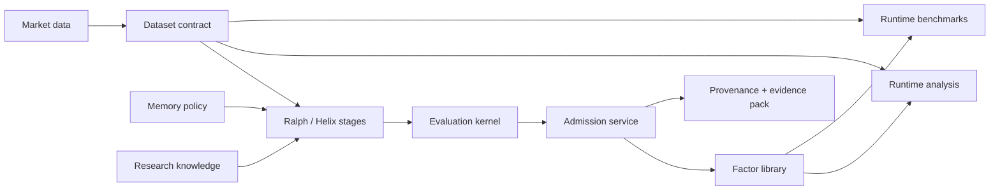

# FactorMiner

**A governed research engine for discovering, evaluating, and documenting
interpretable alpha factors.**

[](https://www.python.org/downloads/)
[](LICENSE)
[](https://github.com/minihellboy/factorminer/actions/workflows/ci.yml)

FactorMiner combines a typed formula DSL, LLM-guided search, structured memory,
strict runtime recomputation, and reviewable research artifacts. It follows the
system described in [*FactorMiner: A Self-Evolving Agent with Skills and
Experience Memory for Financial Alpha Discovery*](https://arxiv.org/abs/2602.14670)
and extends it with explicit architecture contracts, stronger validation, and a
model-agnostic agent integration surface.

FactorMiner is research infrastructure. It proposes and evaluates artifacts; it
does not recommend trades, size positions, bind risk limits, route orders, or
operate an autonomous account.

## What is included

| Surface | Purpose |
| --- | --- |
| Typed DSL and operator registry | Safe, interpretable formulas over OHLCV and registered feature leaves |
| `RalphLoop` | Canonical paper-style generate/evaluate/evolve lane |
| `HelixLoop` | Extended retrieval, debate, canonicalization, and validation lane |
| Policy-based memory | Paper, none, KG, family-, regime-, and edit-aware policies |
| Runtime evaluation | Formula recomputation on the supplied dataset; saved summaries are not trusted as truth |
| Benchmark runtime | Top-K freeze, memory/strategy ablations, CPCV/PBO, cost pressure, and efficiency |
| Research knowledge | Persistent screened sources and hypotheses with bounded retrieval and outcome attribution |
| Evidence packs | Immutable, content-addressed factor evidence with dataset/config/code hashes and integrity verification |
| Research extensions | EDGAR/futures data, crowding, capacity, sensitivity, model-risk, and provenance artifacts |
| Agent gateway | MCP server plus a plugin and managed-agent reference integration |

The built-in catalog contains 110 normalized paper factors. Named third-party
baselines are not all faithful reproductions; manifests label catalog subsets,
proxies, runtime loops, and saved libraries explicitly. See
[Reproducibility](docs/reproducibility.md) before interpreting benchmark output.

## Install

The recommended contributor setup uses [uv](https://docs.astral.sh/uv/):

```bash
git clone https://github.com/minihellboy/factorminer.git
cd factorminer
uv sync --group dev --all-extras
```

For a smaller local environment:

```bash
uv sync --group dev
uv sync --group dev --extra llm   # add hosted/local LLM providers
uv sync --group dev --extra mcp   # add the MCP server
```

The portable default backend is NumPy. The CUDA extra is Linux-oriented; use
`--gpu` only where CUDA is available. A pip editable install also works:

```bash
python3 -m pip install -e ".[llm,mcp]"
```

## Quick start

No API key is required for the deterministic demo and mock workflow:

```bash
uv run python scripts/run_demo.py
uv run factorminer quickstart
uv run factorminer doctor --json
```

`quickstart` writes a small library and static report under
`/tmp/factorminer-quickstart`. To mine directly:

```bash
uv run factorminer -o /tmp/factorminer-run mine --mock -n 2 -b 8 -t 10
uv run factorminer session inspect /tmp/factorminer-run --telemetry
```

For real data, validate the schema first:

```bash
uv run factorminer validate-data path/to/market_data.csv
uv run factorminer -c factorminer.local.yaml -o output-real \
  mine --data path/to/market_data.csv
```

The minimum panel fields are:

```text
datetime, asset_id, open, high, low, close, volume, amount
```

Identifier aliases such as `symbol`, `ticker`, `code`, and `ts_code` are
accepted. Missing `vwap` and `returns` can be derived by the runtime layer.

## Core workflows

Run the extended research lane:

```bash
uv run factorminer --cpu helix --mock --debate --canonicalize -n 2 -b 8 -t 10
```

Recompute and evaluate a saved library:

```bash
uv run factorminer --cpu evaluate output/factor_library.json \
  --mock --period both --top-k 10
```

Build a composite on explicit fit/evaluation splits:

```bash
uv run factorminer --cpu combine output/factor_library.json \
  --mock --fit-period train --eval-period test --method all \
  --selection lasso --top-k 20
```

Run a benchmark or the standalone Phase 2 report builder:

```bash
uv run factorminer --cpu --config factorminer/configs/paper_repro.yaml \
  benchmark table1 --mock --baseline factor_miner
uv run factorminer --cpu benchmark ablation-strategy --mock \
  --baseline factor_miner
uv run python scripts/run_phase2_benchmark.py --mock
```

The CLI also exposes data validation/resampling, visualization, CPCV, portfolio
construction, crowding and sensitivity diagnostics, EDGAR/futures attachment,
research ingestion, RFT dataset export, sealed search, model co-optimization,
and MCP transports. Use `uv run factorminer --help` and command-level `--help`
as the authoritative command reference.

Research ingestion persists both eligible and rejected source decisions. An
eligible source produces a content-addressed hypothesis that mining can retrieve
without placing raw documents in prompts:

```bash
uv run factorminer -o output ingest-research path/to/note.txt --mock
uv run factorminer -o output verify-evidence
```

## Architecture



Both loops use the same validated factor generator, parser, stage contract,
admission service, and policy persistence. Helix adds richer components without
creating a parallel benchmark or memory infrastructure. The architecture layer
owns reusable contracts and policy; loops should remain orchestration.

See [Architecture](docs/architecture.md) for contracts, package ownership, and
dependency direction.

## Repository layout

```text
factorminer/
├── factorminer/
│   ├── application/    typed execution context and workflow contracts
│   ├── architecture/   contracts, policies, stages, reusable services
│   ├── core/           loops, DSL parser, expression trees, library, I/O
│   ├── domain/         dependency-free numerical contracts
│   ├── agent/          providers, prompts, generation, debate
│   ├── data/           loaders, preprocessing, connectors, tensor building
│   ├── evaluation/     recomputation, metrics, validation, reports
│   ├── benchmark/      contracts, datasets, runners, statistics, reports
│   ├── memory/         stores, retrieval, KG, embeddings
│   ├── operators/      typed operator specs and execution backends
│   ├── mcp/            agent-facing MCP server
│   └── tests/          regression and contract coverage
├── integrations/       plugin and managed-agent reference deployments
├── scripts/            demos, standalone runners, repository validation
├── docs/               architecture, reproducibility, security
└── data/               documented public onboarding sample
```

`output/` is mutable runtime state and intentionally ignored. Repository-local
configuration belongs in a separate untracked file, not in the shipped defaults.

## Agent and financial-services integration

FactorMiner can run as a local stdio MCP server or an opt-in authenticated HTTP
server. The reference `factor-researcher` integration keeps two deployment
forms beside each other:

- `integrations/factor-researcher/plugin/`
- `integrations/factor-researcher/managed-agent/`

Both reuse the same system prompt and skills. External data services remain
customer-controlled; FactorMiner preserves the research-only boundary and
returns artifacts for human review. Setup, connector examples, permissions,
and deployment notes are in the
[integration guide](integrations/factor-researcher/README.md).

## Documentation

| Document | Owns |
| --- | --- |
| [Architecture](docs/architecture.md) | Runtime contracts, dependency direction, and package ownership |
| [Reproducibility](docs/reproducibility.md) | Data contracts, metrics, baseline provenance, public and paper-scale workflows |
| [Security](docs/security.md) | Connectors, MCP, model/content boundaries, persistence, secrets |
| [License](LICENSE) | MIT license terms for the entire project |
| [Integration guide](integrations/factor-researcher/README.md) | Agent packaging, financial-data connectors, deployment guardrails |
| [Contributing](CONTRIBUTING.md) | PR scope, checks, ownership, and documentation governance |

## Development

```bash
uv run ruff check .
uv run python scripts/check_architecture.py
uv run python scripts/check.py
uv run pytest -q factorminer/tests
uv build
```

See [Contributing](CONTRIBUTING.md) for focused test commands, import-boundary
rules, and PR expectations.

## License

FactorMiner is licensed under the MIT License. See [LICENSE](LICENSE) for the
full license text.
