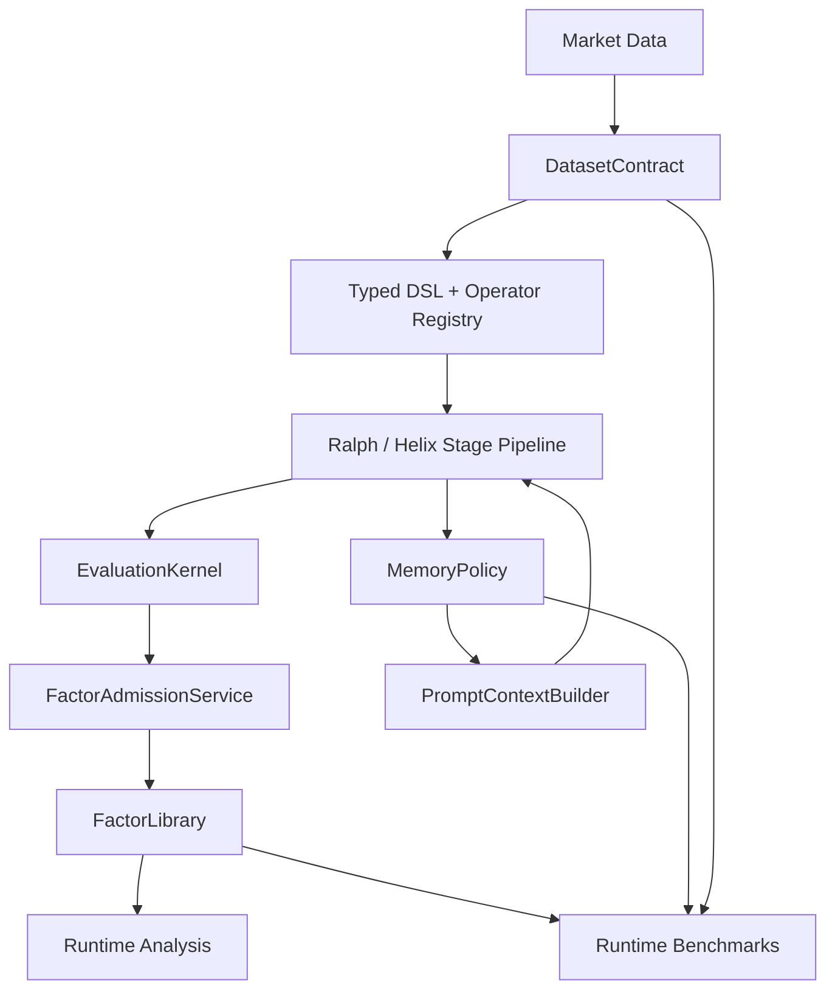
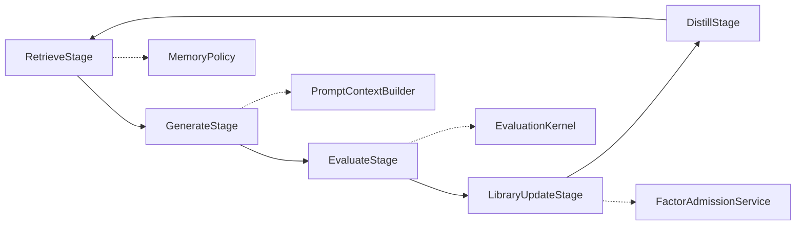

# FactorMiner

**LLM-driven formulaic alpha mining with typed operators, structured memory, strict runtime recomputation, and a Phase 2 Helix research lane**

[](https://www.python.org/downloads/)
[](LICENSE)
[](https://github.com/minihellboy/factorminer/actions/workflows/ci.yml)

FactorMiner is a research framework for discovering interpretable alpha factors from market data. It combines:

- a typed DSL over OHLCV-style market features
- an LLM-guided mining loop
- structured experience memory
- library admission and replacement based on predictive power and orthogonality
- strict runtime recomputation for analysis and benchmark reporting
- an extended Helix lane for Phase 2 retrieval, canonicalization, and post-admission validation

The implementation is based on *FactorMiner: A Self-Evolving Agent with Skills and Experience Memory for Financial Alpha Discovery* (Wang et al., 2026), then extended with a cleaner architecture layer and a broader research surface.

## Repository Status

Current implementation snapshot:

- `132` Python files under `factorminer/`
- `51,273` lines of Python
- `70` registered DSL operators
- `110` paper factors shipped in the built-in catalog
- `477` collected tests in `factorminer/tests`

Primary execution surfaces:

- `RalphLoop`: canonical paper-style mining loop
- `HelixLoop`: Phase 2 research loop with optional retrieval and validation extensions
- `factorminer.benchmark.runtime`: canonical benchmark runner
- `factorminer.architecture`: canonical contracts, policies, stages, and services

## Documentation Map

- [Architecture Deep Dive](docs/architecture.md)
- [Metric Semantics](docs/metrics.md)
- [FAQ](docs/faq.md)
- [Reproducibility Guide](docs/reproducibility.md)
- [Binance Reproduction Notes](docs/binance-reproduction.md)
- [Repo Audit](docs/repo-audit.md)
- [Contributing](CONTRIBUTING.md)
- [Roadmap](ROADMAP.md)

## Architecture At A Glance



Two execution lanes share the same core contracts:

| Lane | Purpose | Canonical loop | Typical use |
| --- | --- | --- | --- |
| Paper lane | strict, benchmark-facing mining | `RalphLoop` | reproducible paper-style runs, library freeze, runtime evaluation |
| Helix lane | extended research mode | `HelixLoop` | debate, KG retrieval, family-aware prompts, canonicalization, Phase 2 validation |

## Core Concepts

### 1. Typed factor DSL

Factors are formulas over the canonical feature set:

```text
$open, $high, $low, $close, $volume, $amt, $vwap, $returns
```

The DSL is parsed into expression trees, executed through the operator registry, and recomputed on demand during analysis and benchmarks.

### 2. Memory-guided mining

Mining is not plain prompt-and-filter generation. The loop builds a structured retrieval signal from experience memory and library state, then uses it to steer candidate generation.

Supported memory policies:

- `paper`
- `none`
- `kg`
- `family_aware`
- `regime_aware`

### 3. Strict runtime recomputation

Saved library metadata is not treated as the final source of truth for analysis. The `evaluate`, `combine`, `visualize`, and benchmark paths recompute factor signals from formulas on the supplied dataset.

### 4. Canonical benchmark surface

`factorminer.benchmark.runtime` is the canonical benchmark entry point. It supports:

- Top-K freeze evaluation across universes
- memory ablations
- strategy-grid ablations over `memory policy × dependence metric × backend`
- cost-pressure evaluation
- operator and factor efficiency benchmarking

## Canonical Runtime Flow



The same stage contract is used by both Ralph and Helix. Helix swaps in richer implementations for retrieval, proposal, validation, and distillation without changing the orchestration model.

## Setup

### Recommended: `uv`

```bash
git clone https://github.com/minihellboy/factorminer.git
cd factorminer

uv sync --group dev
uv sync --group dev --extra llm
uv sync --group dev --all-extras
```

Notes:

- `uv sync --group dev --all-extras` is the intended full contributor setup.
- The GPU extra is Linux-oriented because `cupy-cuda12x` is not generally installable on macOS.
- The packaged default config uses the portable NumPy backend. Pass `--gpu` only when CUDA is available.
- Wheels and sdists include `factorminer/configs/*.yaml` and exclude the internal test package.
- Use `uv run ...` for all local commands.

### `pip` fallback

```bash
python3 -m pip install -e .
python3 -m pip install -e ".[llm]"
python3 -m pip install -e ".[all]"
```

## Quick Start

### Demo without API keys

```bash
uv run python run_demo.py
```

### One-command quickstart

```bash
uv run factorminer quickstart
```

This runs `doctor`, mines a tiny mock library into
`/tmp/factorminer-quickstart`, generates a static HTML report, and prints the
next commands for real data.

### Deterministic quickstart examples

For a runnable, data-shaped walkthrough with sample CSVs and safe `/tmp` output paths, see [examples/quickstart/README.md](examples/quickstart/README.md).

### CLI overview

```bash
uv run factorminer --help
```

Primary commands:

- `doctor`
- `init-config`
- `quickstart`
- `validate-data`
- `resample-data`
- `mine`
- `helix`
- `evaluate`
- `combine`
- `visualize`
- `benchmark`
- `export`
- `session inspect`

## Common Workflows

### Mine with mock data

```bash
uv run factorminer mine --mock -n 2 -b 8 -t 10
```

Omitting `--gpu` and `--cpu` respects the configured backend. The shipped default is `numpy`; `--gpu` and `--cpu` are explicit overrides.

Paper-mode admission and benchmark selection use `ic_paper_mean =
abs(mean(IC_t))` and `ic_paper_icir = abs(mean(IC_t)) / std(IC_t)`. The legacy
diagnostic `ic_abs_mean = mean(abs(IC_t))` is still reported but is not the
default paper quality gate. See [Metric Semantics](docs/metrics.md).

### First-run health check

```bash
uv run factorminer doctor
uv run factorminer doctor --json
```

### Create a local starter config

```bash
uv run factorminer init-config factorminer.local.yaml
uv run factorminer --config factorminer.local.yaml mine --mock
```

### Run Helix with selected Phase 2 features

```bash
uv run factorminer --cpu helix --mock --debate --canonicalize -n 2 -b 8 -t 10
```

### Evaluate a saved library with strict recomputation

```bash
uv run factorminer --cpu evaluate output/factor_library.json --mock --period both --top-k 10
```

### Combine factors on explicit fit/eval splits

```bash
uv run factorminer --cpu combine output/factor_library.json \
  --mock \
  --fit-period train \
  --eval-period test \
  --method all \
  --selection lasso \
  --top-k 20
```

### Visualize recomputed artifacts

```bash
uv run factorminer --cpu visualize output/factor_library.json \
  --mock \
  --period test \
  --correlation \
  --ic-timeseries \
  --quintile \
  --tearsheet
```

### Run the strict paper benchmark lane

```bash
uv run factorminer --cpu --config factorminer/configs/paper_repro.yaml \
  benchmark table1 --mock --baseline factor_miner
```

### Run the strategy-grid ablation lane

```bash
uv run factorminer --cpu benchmark ablation-strategy --mock --baseline factor_miner
```

### Inspect a completed or partial session

```bash
uv run factorminer session inspect output
uv run factorminer session inspect output --json
```

## Benchmark Surface

Available benchmark commands:

- `benchmark table1`
- `benchmark ablation-memory`
- `benchmark ablation-strategy`
- `benchmark cost-pressure`
- `benchmark efficiency`
- `benchmark suite`

The benchmark suite uses the runtime recomputation layer and carries protocol, dataset, and runtime-manifest metadata into emitted artifacts.

## Configuration Model

The default config lives at [`factorminer/configs/default.yaml`](factorminer/configs/default.yaml).

Top-level config sections:

- `mining`
- `evaluation`
- `data`
- `llm`
- `memory`
- `phase2`
- `benchmark`
- `research`

Important configuration themes:

- `evaluation.backend`: `numpy`, `c`, or `gpu`
- `--gpu/--cpu`: explicit CLI backend override; omitted means use config
- `evaluation.redundancy_metric`: `spearman`, `pearson`, or `distance_correlation`
- `memory.policy`: `paper`, `none`, `kg`, `family_aware`, or `regime_aware`
- `benchmark.strategy_ablation.*`: runtime grid over memory policy, dependence metric, and backend
- `research.*`: multi-horizon scoring, uncertainty controls, and selection models

Profile configs shipped in the repo:

- [`factorminer/configs/paper_repro.yaml`](factorminer/configs/paper_repro.yaml)
- [`factorminer/configs/benchmark_full.yaml`](factorminer/configs/benchmark_full.yaml)
- [`factorminer/configs/helix_research.yaml`](factorminer/configs/helix_research.yaml)
- [`factorminer/configs/demo_local.yaml`](factorminer/configs/demo_local.yaml)

## Data Format

Input data is expected to include at least:

```text
datetime, asset_id, open, high, low, close, volume, amount
```

Accepted identifier aliases include `code`, `ticker`, `symbol`, `ts_code`, and `amt`. If `vwap` or `returns` are missing, the runtime layer derives them.

## Project Layout

```text
factorminer/
├── agent/           LLM providers, prompts, debate
├── architecture/    Canonical contracts, policies, stages, services
├── benchmark/       Runtime benchmark suite and legacy benchmark helpers
├── configs/         YAML profiles
├── core/            Loops, parser, expression trees, factor library, I/O
├── data/            Loaders, preprocessing, tensor building, mock data
├── evaluation/      Metrics, runtime recomputation, analysis, validation
├── memory/          Experience memory, KG retrieval, embeddings
├── operators/       Operator specs, backends, registry
├── tests/           Pytest coverage
└── utils/           Config loading, plotting, reporting
```

## Current Implementation Notes

- `factorminer.architecture` is now the canonical place for protocol, dataset, memory, evaluation, stage, and prompt boundaries.
- `factorminer.benchmark.runtime` is the canonical benchmark runner.
- `factorminer.benchmark.helix_benchmark` and `run_phase2_benchmark.py` are still present, but they are legacy-facing compared with the runtime suite.
- `output/` is ignored and should be treated as mutable runtime state, not source-controlled project state.

## Development

### Run tests

```bash
uv run pytest -q factorminer/tests
```

### Lint

```bash
uv run ruff check .
```

### Build a wheel

```bash
uv build
```

### Scoped type-health check

Full-repo mypy is intentionally non-blocking for now. The current cleanup target reports the fixed stabilization surface without making CI depend on it:

```bash
uv run mypy --ignore-missing-imports --follow-imports=skip factorminer/utils/config.py factorminer/evaluation/runtime.py factorminer/operators/sandbox.py factorminer/operators/custom.py factorminer/operators/auto_inventor.py factorminer/memory/evolution.py factorminer/memory/online_regime_memory.py factorminer/cli.py
```

## License

MIT. See [`LICENSE`](LICENSE).
