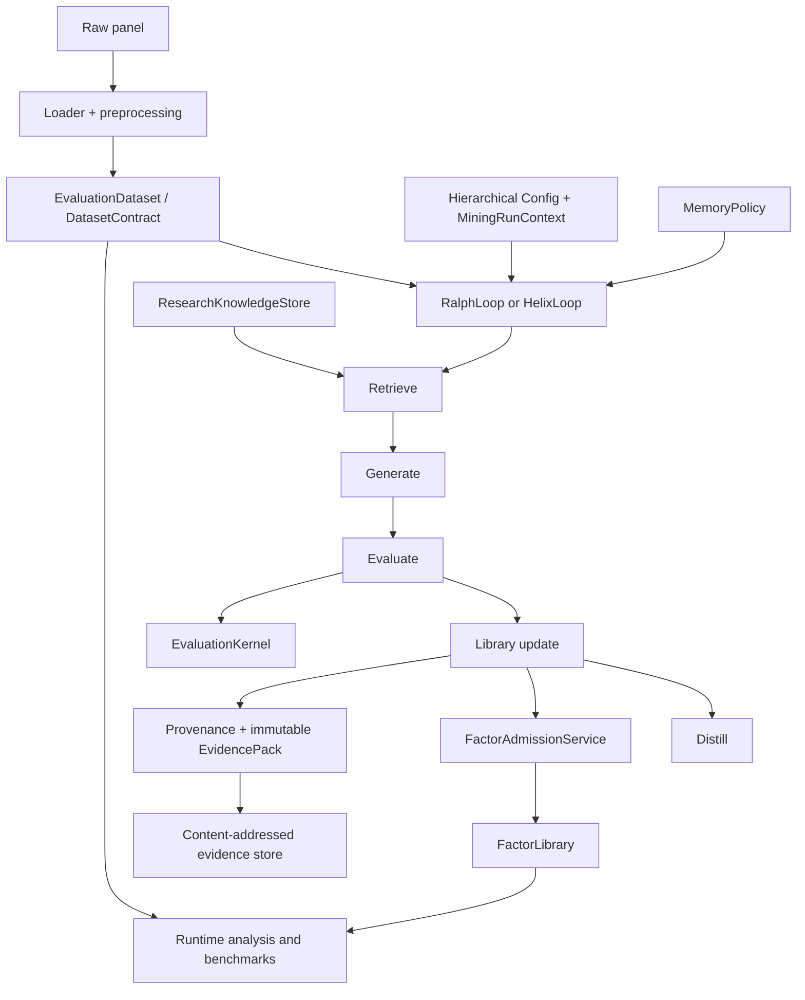

# Architecture

FactorMiner separates research protocol, orchestration, execution, persistence,
and integration concerns so improvements do not fork the scientific contract.
This document owns those boundaries. See [Reproducibility](reproducibility.md)
for metric and benchmark semantics, and [Security](security.md) for trust
boundaries.

## System shape



The authoritative rule is simple: saved factor summaries are useful metadata,
but analysis and benchmarks recompute formula signals on the supplied dataset.
Dataset, split, target, metric, and baseline provenance travel with emitted
artifacts.

## Domain and application contracts

Numerical domain semantics live below orchestration and do not import application
or interface code. Reusable workflow semantics live in
`factorminer/architecture/`, not in CLI handlers or loop-specific branches.

| Contract | Module | Responsibility |
| --- | --- | --- |
| Run context | `application/runtime_context.py` | output location, materialized targets, explicit per-run overrides |
| Loop execution | `core/loop_services.py` | the shared retrieve/generate/evaluate/update/distill sequence and telemetry |
| Mining services | `application/mining_budget.py`, `validation_pipeline.py`, `mining_reporting.py` | resource accounting, evaluation orchestration, and reporting |
| Run artifacts | `application/run_artifacts.py`, `evidence_service.py` | manifests, provenance attachment, evidence construction, storage, and verification |
| Evidence | `domain/evidence.py` | immutable JSON values, evidence identity, attestation state, and integrity verification |
| Paper protocol | `paper_protocol.py` | targets, thresholds, replacement, Top-K freeze, artifact contract |
| Dataset | `dataset_contract.py` | shape, target stack, split-aware runtime description |
| Evaluation | `evaluation_kernel.py` | candidate scoring and redundancy/replacement decisions |
| Dependence | `domain/dependence.py` | Spearman, Pearson, distance-correlation, and span diagnostics |
| Geometry | `geometry.py` | saturation, candidate/library dependence, replacement eligibility |
| Memory | `memory_policy.py` | retrieval, formation, evolution, persistence, restoration |
| Prompts | `prompt_context.py` | typed conversion of memory/library state into generator context |
| Lifecycle | `lifecycle.py` | proposal, rejection, admission, and distillation trajectories |
| Stages | `stages.py` | retrieve/generate/evaluate/update/distill interfaces |
| Admission | `library_services.py` | the mutation boundary for factor libraries |
| Phase 2 construction | `phase2_services.py` | optional Helix component factory and update services |
| Research planning | `research_absorption.py`, `research_planner.py`, `application/research_knowledge.py` | source screening, persistent hypotheses, bounded retrieval, routing, and outcome attribution |
| Experimental search | `island_model.py`, `sealed_joint_search.py` | opt-in population and multi-evaluator modes |
| Training export | `rft_export.py` | reward-annotated offline datasets; no in-process model training |

## Mining lanes

`RalphLoop` and `HelixLoop` share:

- the validated `agent.factor_generator.FactorGenerator` path;
- structured output parsing, repair, cascade, and prompt-cache behavior;
- the stage contract and factor-admission service;
- policy-based memory retrieval and persistence;
- lifecycle/provenance records and checkpoint conventions.

`RalphLoop` is the canonical paper-style lane. It orchestrates a bounded
generate/evaluate/evolve run and delegates scientific rules to architecture
services.

`HelixLoop` swaps richer implementations into the same outer sequence. It can
add KG or embedding retrieval, debate, canonicalization, semantic deduplication,
post-admission validation, online forgetting, and Phase 2 updates. These are
optional components, not a second protocol.

Both loops construct `FactorGenerator`, `MemoryPolicy`, `LoopExecutionService`,
`MiningArtifactService`, and `ResearchKnowledgeStore` through the same Ralph
initialization path. Helix replaces only named stage implementations and
optional validation services. There is no loop-local factor generator, memory
manager, or benchmark engine.

## Data and expression execution

The normal data path is:

```text
DataFrame / loader
  → preprocessing and schema normalization
  → tensor builder
  → EvaluationDataset + DatasetContract
  → mining, analysis, or benchmark runtime
```

`utils.config.Config` is the reusable configuration source. `MiningRunContext`
holds execution-specific state such as output paths and materialized target
panels; loops read the hierarchical sections through a read-only
`MiningSettings` view. DataFrame inputs use `load_runtime_dataset`, while
already-aligned numerical panels use `build_runtime_dataset_from_arrays`.

Canonical formula leaves include `$open`, `$high`, `$low`, `$close`, `$volume`,
`$amt`, `$vwap`, and `$returns`. The feature registry can add scoped leaves such
as point-in-time EDGAR fundamentals or futures attributes. Formulas are parsed
into expression trees and evaluated through typed operators and a selected
backend (`numpy`, `c`, or `gpu`).

Split boundaries come from `data.train_period` and `data.test_period`. The
`evaluate`, `combine`, `visualize`, and benchmark paths all consume the same
runtime split model.

## Memory and retrieval

Every `MemoryPolicy` declares its schema and owns retrieval, formation,
evolution, serialization, and restoration.

| Policy | Role |
| --- | --- |
| `paper` | flat success/failure/insight experience used by the canonical lane |
| `none` | memory ablation |
| `kg` | knowledge-graph and hybrid lexical/dense retrieval |
| `family_aware` | steering toward family gaps and away from saturation |
| `regime_aware` | context conditioned on detected market state |
| `edit_aware` | parent→child AST-edit credit and veto memory |

`FactorFamilyDiscovery` supplies fine-grained formula categories and a coarser
mechanism taxonomy. The prompt builder receives summaries, not raw mutable
stores. Edit-aware memory receives real parent and secondary-parent lineage from
the loops.

External research is a separate data plane from experience memory.
`ResearchKnowledgeStore` writes content-addressed A-layer source decisions,
B/C-layer hypotheses, and per-candidate outcomes below
`output/research_knowledge/`. Retrieval ranks stored hypotheses by observed
admission yield and uncovered formula families, caps the result with
`research.knowledge_retrieval_limit`, and injects only structured archetypes.
The exact `source_ids` and `hypothesis_ids` used for a batch are copied into
factor provenance and evidence packs.

## Evaluation and admission

`EvaluationKernel` computes candidate evidence. `LibraryGeometry` summarizes
dependence and saturation. `FactorAdmissionService` is the only normal mutation
path for the library, including cross-island migrants.

Dependence strategies are explicit and serializable:

- `spearman`
- `pearson`
- `distance_correlation`

The evaluation package also contains opt-in research diagnostics for
significance, CPCV/PBO, decay, causal checks, crowding, capacity, portfolio
construction, formula sensitivity, and model-risk evidence. These diagnostics
must not silently change canonical admission.

## Benchmark runtime

The benchmark package has one execution path with explicit module ownership:

| Module | Responsibility |
| --- | --- |
| `runtime.py` | benchmark orchestration and public run functions |
| `contracts.py` | immutable manifest, walk-forward, stress, and strategy-grid contracts |
| `runtime_contracts.py` | construction of runtime contracts from effective configuration and dataset state |
| `provenance.py` | content hashes and provenance for catalogs, saved libraries, sessions, and artifacts |
| `mining_runtime.py` | Ralph/Helix benchmark configuration, construction, execution, and loop provenance |
| `datasets.py` | dataset loading, config projection, baseline catalogs, and library construction |
| `frozen_evaluation.py` | train-only selection and held-out recomputation |
| `statistics.py` | result contracts and statistical comparisons |
| `runners.py` | live-loop Phase 2 component ablations |
| `speed.py` | operator and factor timing |
| `reporting.py`, `phase2_reporting.py` | strict artifacts, tables, manifests, and narrative rendering |

Together these modules implement:

- Table 1-style frozen Top-K evaluation;
- memory and strategy-grid ablations;
- transaction-cost pressure;
- CPCV and Probability of Backtest Overfitting;
- operator/factor efficiency;
- the suite runner and machine-readable manifests.

`scripts/run_phase2_benchmark.py` is an executable composition layer over
`run_phase2_comparison`, `run_phase2_ablation_study`, and package-owned report
renderers. It does not define a benchmark class or evaluation engine.

## Persistence and artifacts

Mining sessions can persist the library, memory payload, loop state, run
manifest, lifecycle ledger, session metadata, evidence packs, research
knowledge, and optional signal cache.
Restoration is policy-specific. Runtime reports and benchmark bundles identify
the dataset, metric version, protocol, baseline provenance, and relevant
configuration.

Every admitted factor carries one or more evidence IDs. `EvidencePack` freezes
the formula AST, lineage, split metrics, failure evidence, cost/capacity/regime/
significance/model-risk results, generator identity, data/config/code hashes,
admission and replacement decisions, source attribution, approval state, and
explicit human-attestation state. The SHA-256 evidence ID covers the canonical
payload; `factorminer verify-evidence` detects payload or filename tampering.

`output/` is mutable runtime state and is ignored by Git. The current local
artifact directory is neither immutable nor signed.

## Ownership and dependency direction

| Package | Owns | Must not own |
| --- | --- | --- |
| `domain` | dependency-free numerical contracts shared across workflows | orchestration, adapters, or interfaces |
| `application` | typed execution context and cross-workflow application contracts | CLI parsing or numerical domain semantics |
| `architecture` | contracts, policies, stages, reusable research services | CLI parsing or provider-specific UI |
| `core` | loop orchestration, DSL/parser, expressions, library, session I/O | parallel benchmark or policy implementations |
| `agent` | model providers, prompts, generation, debate | metric/admission truth |
| `data` | ingestion, normalization, connectors, tensor construction | research decisions |
| `evaluation` | recomputation, metrics, diagnostics, reports | loop orchestration |
| `benchmark` | comparative contracts, datasets, runners, statistics, and reports | alternate loop infrastructure |
| `memory` | stores, retrieval primitives, KG, embeddings | loop-specific persistence policy |
| `operators` | typed specs and execution backends | data acquisition |
| `mcp` | narrow external tool/resource surface | core research logic |

Dependency direction is executable: domain modules cannot import higher layers,
adapters cannot import application or interface layers, and application modules
cannot import CLI, MCP, or benchmark interfaces. `scripts/check_architecture.py`
enforces these rules in CI. Package exports are lazy and regression-tested in
`test_import_boundaries.py`; integration manifests and local references are
checked by `scripts/check.py`.
