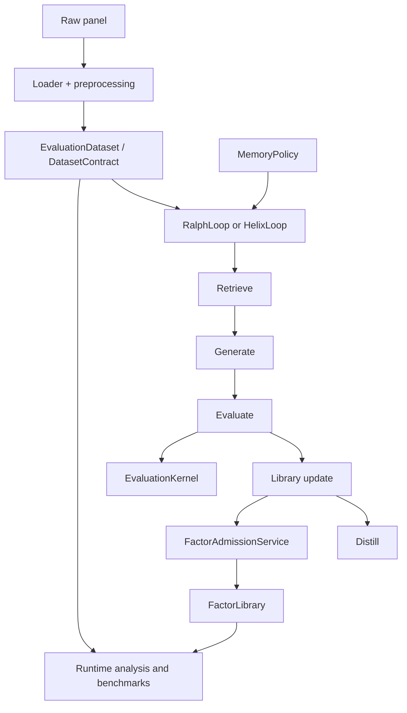

# Architecture

FactorMiner separates research protocol, orchestration, execution, persistence,
and integration concerns so improvements do not fork the scientific contract.
This document owns those boundaries. See [Reproducibility](reproducibility.md)
for metric and benchmark semantics, and [Security](security.md) for trust
boundaries.

## System shape



The authoritative rule is simple: saved factor summaries are useful metadata,
but analysis and benchmarks recompute formula signals on the supplied dataset.
Dataset, split, target, metric, and baseline provenance travel with emitted
artifacts.

## Canonical contracts

Reusable research semantics live in `factorminer/architecture/`, not in CLI
handlers or loop-specific branches.

| Contract | Module | Responsibility |
| --- | --- | --- |
| Paper protocol | `paper_protocol.py` | targets, thresholds, replacement, Top-K freeze, artifact contract |
| Dataset | `dataset_contract.py` | shape, target stack, split-aware runtime description |
| Evaluation | `evaluation_kernel.py` | candidate scoring and redundancy/replacement decisions |
| Dependence | `dependence.py` | Spearman, Pearson, and distance-correlation strategies |
| Geometry | `geometry.py` | saturation, candidate/library dependence, replacement eligibility |
| Memory | `memory_policy.py` | retrieval, formation, evolution, persistence, restoration |
| Prompts | `prompt_context.py` | typed conversion of memory/library state into generator context |
| Lifecycle | `lifecycle.py` | proposal, rejection, admission, and distillation trajectories |
| Stages | `stages.py` | retrieve/generate/evaluate/update/distill interfaces |
| Admission | `library_services.py` | the mutation boundary for factor libraries |
| Phase 2 construction | `phase2_services.py` | optional Helix component factory and update services |
| Research planning | `research_absorption.py`, `research_planner.py` | document eligibility and mechanism-family routing |
| Experimental search | `island_model.py`, `sealed_joint_search.py` | opt-in population and multi-evaluator modes |
| Training export | `rft_export.py` | reward-annotated offline datasets; no in-process model training |

## Mining lanes

`RalphLoop` and `HelixLoop` share:

- the validated `agent.factor_generator.FactorGenerator` path;
- structured output parsing, repair, cascade, and prompt-cache behavior;
- the stage contract and factor-admission service;
- policy-based memory retrieval and persistence;
- lifecycle/provenance records and checkpoint conventions.

`RalphLoop` is the canonical paper-style lane. It orchestrates a bounded
generate/evaluate/evolve run and delegates scientific rules to architecture
services.

`HelixLoop` swaps richer implementations into the same outer sequence. It can
add KG or embedding retrieval, debate, canonicalization, semantic deduplication,
post-admission validation, online forgetting, and Phase 2 updates. These are
optional components, not a second protocol.

The old `ExperienceMemoryManager` and `benchmark.helix_benchmark` remain
compatibility facades. Production loops use `MemoryPolicy`; benchmark execution
uses `benchmark.runtime`.

## Data and expression execution

The normal data path is:

```text
DataFrame / loader
  → preprocessing and schema normalization
  → tensor builder
  → EvaluationDataset + DatasetContract
  → mining, analysis, or benchmark runtime
```

Canonical formula leaves include `$open`, `$high`, `$low`, `$close`, `$volume`,
`$amt`, `$vwap`, and `$returns`. The feature registry can add scoped leaves such
as point-in-time EDGAR fundamentals or futures attributes. Formulas are parsed
into expression trees and evaluated through typed operators and a selected
backend (`numpy`, `c`, or `gpu`).

Split boundaries come from `data.train_period` and `data.test_period`. The
`evaluate`, `combine`, `visualize`, and benchmark paths all consume the same
runtime split model.

## Memory and retrieval

Every `MemoryPolicy` declares its schema and owns retrieval, formation,
evolution, serialization, and restoration.

| Policy | Role |
| --- | --- |
| `paper` | flat success/failure/insight experience used by the canonical lane |
| `none` | memory ablation |
| `kg` | knowledge-graph and hybrid lexical/dense retrieval |
| `family_aware` | steering toward family gaps and away from saturation |
| `regime_aware` | context conditioned on detected market state |
| `edit_aware` | parent→child AST-edit credit and veto memory |

`FactorFamilyDiscovery` supplies fine-grained formula categories and a coarser
mechanism taxonomy. The prompt builder receives summaries, not raw mutable
stores. Edit-aware memory receives real parent and secondary-parent lineage from
the loops.

## Evaluation and admission

`EvaluationKernel` computes candidate evidence. `LibraryGeometry` summarizes
dependence and saturation. `FactorAdmissionService` is the only normal mutation
path for the library, including cross-island migrants.

Dependence strategies are explicit and serializable:

- `spearman`
- `pearson`
- `distance_correlation`

The evaluation package also contains opt-in research diagnostics for
significance, CPCV/PBO, decay, causal checks, crowding, capacity, portfolio
construction, formula sensitivity, and model-risk evidence. These diagnostics
must not silently change canonical admission.

## Benchmark runtime

`factorminer.benchmark.runtime` is the single benchmark implementation. It owns:

- Table 1-style frozen Top-K evaluation;
- memory and strategy-grid ablations;
- transaction-cost pressure;
- CPCV and Probability of Backtest Overfitting;
- operator/factor efficiency;
- the suite runner and machine-readable manifests.

`benchmark.helix_benchmark` is import compatibility only. The standalone
`scripts/run_phase2_benchmark.py` composes runtime functions; it does not carry a
parallel benchmark engine.

## Persistence and artifacts

Mining sessions can persist the library, memory payload, loop state, run
manifest, lifecycle ledger, session metadata, and optional signal cache.
Restoration is policy-specific. Runtime reports and benchmark bundles identify
the dataset, metric version, protocol, baseline provenance, and relevant
configuration.

`output/` is mutable runtime state and is ignored by Git. Immutable or signed
artifact registries are future product infrastructure, not a property of the
current local directory.

## Ownership and dependency direction

| Package | Owns | Must not own |
| --- | --- | --- |
| `architecture` | contracts, policies, stages, reusable research services | CLI parsing or provider-specific UI |
| `core` | loop orchestration, DSL/parser, expressions, library, session I/O | parallel benchmark or policy implementations |
| `agent` | model providers, prompts, generation, debate | metric/admission truth |
| `data` | ingestion, normalization, connectors, tensor construction | research decisions |
| `evaluation` | recomputation, metrics, diagnostics, reports | loop orchestration |
| `benchmark` | canonical comparative runtime and compatibility exports | alternate loop infrastructure |
| `memory` | stores, retrieval primitives, KG, embeddings | loop-specific persistence policy |
| `operators` | typed specs and execution backends | data acquisition |
| `mcp` | narrow external tool/resource surface | core research logic |

The intended flow is from interfaces/orchestrators into reusable services, then
into lower-level data, operator, and persistence primitives. Public package
exports are regression-tested in `test_import_boundaries.py`; integration
manifests and local references are checked by `scripts/check.py`.
