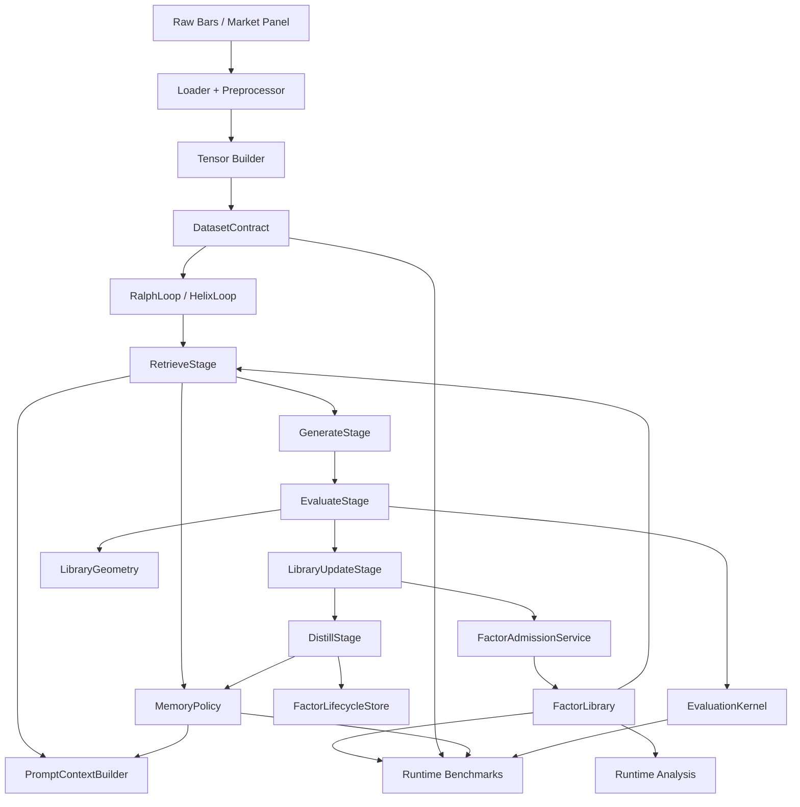
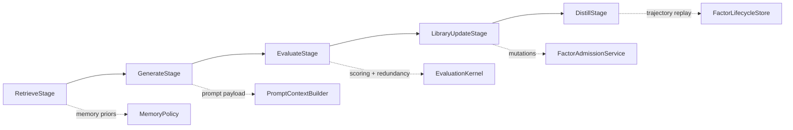
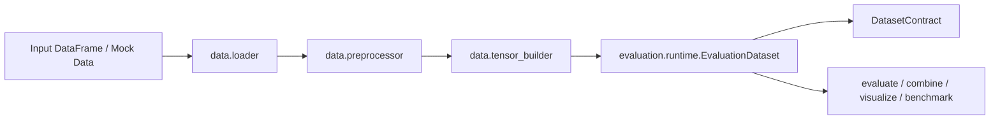
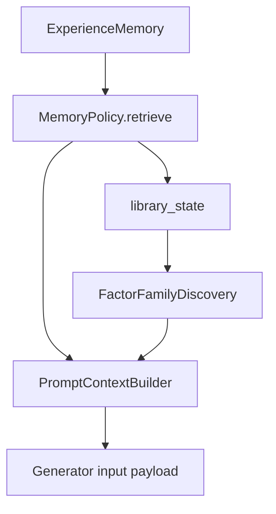
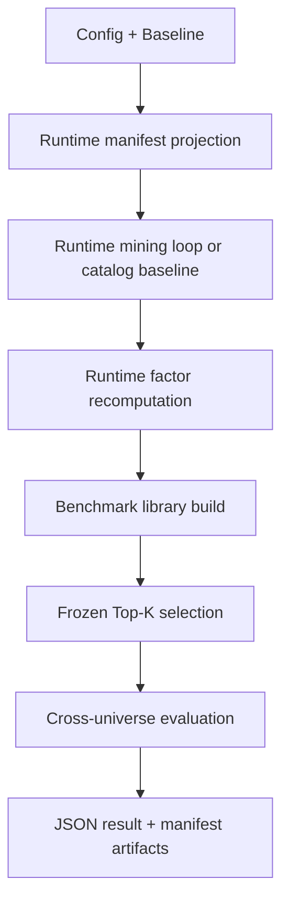

# FactorMiner Architecture

This document describes the current canonical architecture of the repository after the protocol, stage, memory-policy, dependence-metric, and benchmark-runtime refactors.

For a repo-wide inventory and implementation audit, see [Repo Audit](repo-audit.md).

For the security threat model and mitigations behind every externally-facing
surface added in Round 2 (data connectors, MCP HTTP transport, local-LLM
`base_url` provider, LLM-authored content in reports), see
[Security Considerations](security.md).

## Canonical Contracts

The repository now has explicit architecture boundaries under `factorminer/architecture/`.

| Surface | Module | Responsibility |
| --- | --- | --- |
| Paper contract | `paper_protocol.py` | benchmark mode, targets, admission thresholds, replacement rules, Top-K freeze semantics, runtime artifact contract |
| Dataset contract | `dataset_contract.py` | shape metadata, target stack, default target, split-aware runtime dataset description |
| Dependence metrics | `dependence.py` | pluggable redundancy metrics: `spearman`, `pearson`, `distance_correlation` |
| Evaluation kernel | `evaluation_kernel.py` | candidate scoring, redundancy/replacement checks, geometry-aware evaluation rules |
| Geometry | `geometry.py` | library saturation, replacement eligibility, dependence snapshots |
| Memory policy | `memory_policy.py` | retrieval, formation, evolution, serialization, restoration |
| Family discovery | `families.py` | formula-family inference, saturation/gap diagnostics, prompt-facing family summaries |
| Prompt context | `prompt_context.py` | structured memory and family signal to generation payload |
| Lifecycle ledger | `lifecycle.py` | candidate trajectory capture across proposal, rejection, admission, and distillation |
| Stage model | `stages.py` | pluggable retrieve/generate/evaluate/update/distill stage interfaces |
| Library services | `library_services.py` | factor admission and replacement mutation logic, incl. cross-island migrant admission |
| Phase 2 services | `phase2_services.py` | reusable online forgetting and knowledge-graph update logic |
| Model co-optimization | `model_stage.py` | optional periodic downstream-model (Ridge/Lasso/XGBoost) fit + marginal-contribution stage, opt-in and admission-neutral |
| Research absorption | `research_absorption.py` | report-to-memory absorption: OHLCV-eligibility screen and mechanism-family classification for external research notes |
| Research planner | `research_planner.py` | macro research-cycle theme routing (`fixed`/`coarse_guided`/`memory_driven`) over the mechanism-family taxonomy |
| Island model | `island_model.py` | independently-biased parallel mining populations with periodic admission-gated migration |
| RFT export | `rft_export.py` | offline reward computation (Diversity-Complementarity) and reward-annotated JSONL training-dataset export for external GRPO/RFT fine-tuning; exports data only, never trains a model in-process |
| Sealed joint search | `sealed_joint_search.py` (+ private `_sealed_evaluator_panel.py`) | opt-in research mode: multiple differently-biased evaluators with internals sealed from the generation-facing prompt context, promotion gated on cross-evaluator agreement rather than one fixed objective |

## End-to-End Execution Graph

## Loop Architecture

Both mining loops share the same stage contract.

### Ralph loop

`RalphLoop` is the paper-faithful mining lane. Its responsibilities are now:

- instantiate canonical architecture services
- orchestrate stage execution
- own run/session/report lifecycle
- delegate retrieval, prompt construction, evaluation, admission, and memory evolution to services

### Helix loop

`HelixLoop` extends Ralph by swapping stage implementations while preserving the same outer pipeline:

- richer retrieval when KG or embeddings are enabled
- debate-based or standard proposal
- canonicalization and semantic deduplication before evaluation
- optional Phase 2 validation after admission
- KG updates, embedding updates, and online forgetting during distillation

### Stage sequence

## Data and Runtime Contracts

The benchmark and analysis surfaces no longer trust stored factor summaries as authoritative. They recompute factor signals on the supplied dataset.

### Data path

### Split semantics

The following paths use the runtime split definition derived from config:

- `evaluate`
- `combine`
- `visualize`
- `benchmark.runtime`

The authoritative split boundaries come from `data.train_period` and `data.test_period`.

## Memory System

The memory system is now a formal policy boundary rather than loop-local heuristics.

### Policy interface

Every `MemoryPolicy` owns:

- schema declaration
- retrieval contract
- formation contract
- evolution contract
- persistence contract
- restoration contract

### Current policies

| Policy | Purpose | Distinguishing behavior |
| --- | --- | --- |
| `paper` | paper-faithful default | uses flat experience memory and F/E/R operators |
| `none` | ablation | disables retrieval and distillation effects |
| `kg` | structure-aware retrieval | persists and queries a factor knowledge graph |
| `family_aware` | family-saturation steering | reranks retrieval by family gaps and saturated families |
| `regime_aware` | market-state steering | conditions retrieval context on detected active regime |
| `edit_aware` | edge-level credit assignment | AST-diff edit-motif memory (AlphaMemo, arXiv:2606.20625) with confidence-gated residuals and asymmetric veto over parent→child formula edits |

### Memory to prompt path

## Dependence Metrics and Library Geometry

Redundancy is no longer hardcoded to one metric. The architecture exposes explicit dependence metrics:

- `spearman`
- `pearson`
- `distance_correlation`

These are used across:

- library admission
- replacement checks
- candidate/library redundancy evaluation
- library serialization metadata
- runtime benchmark ablations

`LibraryGeometry` centralizes:

- current saturation snapshots
- candidate-to-library dependence summaries
- replacement eligibility
- geometry metadata for the evaluation kernel

## Family Discovery

`FactorFamilyDiscovery` derives prompt-facing family context from formulas and library state.

Current heuristics infer families from operator and feature patterns, including:

- `Momentum`
- `Smoothing`
- `Regression`
- `VWAP`
- `Amount`
- `Volatility`
- `Cross-Sectional`
- `Regime-Conditional`
- `PV-Correlation`
- `Higher-Moment`

- `FamilyAwareMemoryPolicy`
- `PromptContextBuilder`
- category inference for newly admitted factors
- documentation and audit-level library diagnostics

`families.py` also exposes `mechanism_family()`, a coarser 6-bucket grouping
(Trend/Momentum, Reversal/Mean-Reversion, Volatility/Risk, Price-Volume,
Cross-Sectional/Structural, Other) above these fine-grained categories, used by
`ResearchCyclePlanner` (`research_planner.py`) to route mining-cycle themes by
information gap without reimplementing saturation detection.

## Benchmark Runtime

`factorminer.benchmark.runtime` is the canonical benchmark surface.

### Runtime benchmark graph

### Implemented benchmark lanes

| Function | Purpose |
| --- | --- |
| `run_table1_benchmark` | strict Top-K freeze evaluation across universes |
| `run_ablation_memory_benchmark` | compare default lane to no-memory lane |
| `run_ablation_strategy_benchmark` | compare `memory policy × dependence metric × backend` |
| `run_cost_pressure_benchmark` | transaction-cost stress analysis |
| `run_cpcv_benchmark` | Combinatorial Purged Cross-Validation + Probability of Backtest Overfitting (Bailey et al., 2017), alongside the existing Deflated Sharpe Ratio |
| `run_efficiency_benchmark` | operator and factor runtime benchmarking |
| `run_benchmark_suite` | canonical bundle runner |

### Benchmark backends

| Backend | Meaning |
| --- | --- |
| `numpy` | portable CPU execution |
| `c` | Bottleneck-backed compiled CPU kernels |
| `gpu` | torch-backed GPU execution |

## Landscape-Review Extension Modules

Cross-referenced against the wider LLM-alpha-mining and quant-OSS landscape
(see [Landscape Review & Extension Roadmap](landscape-and-extensions.md) for
full sourcing); each lands as a standalone, opt-in module rather than loop
growth, per the contributor rules below.

| Module | Purpose | Landscape source |
| --- | --- | --- |
| `evaluation/cross_validation.py` | Combinatorial Purged Cross-Validation (purge + embargo) and Probability of Backtest Overfitting, completing the Deflated Sharpe Ratio already in `evaluation/significance.py` | Bailey, Borwein, López de Prado & Zhu (2017) |
| `evaluation/decay.py` | Per-factor IC half-life / decay-curve classification (`stable`/`decaying`/`decayed`), surfaced in `session inspect` and static reports | AlphaAgent's alpha-decay framing (arXiv:2502.16789) |
| `evaluation/risk_portfolio.py` | HRP, naive risk parity, and CVaR-optimal position weighting across a combined signal — the layer above `evaluation/combination.py`'s signal blending, numpy/scipy-only | Riskfolio-Lib, Bailey/López de Prado |
| `data/qlib_source.py` | Loader for Qlib-style per-instrument CSV dumps; `core/library_io.py::export_formulas_qlib` best-effort-translates formulas into Qlib `Expression` syntax with unsupported operators explicitly flagged | Qlib (CSI300/CSI500/S&P500 panels used by AlphaMemo, XAlpha, AlphaForge) |
| `data/mcp_source.py` (`columns_order`/`constant_columns`/`derive_amount_from_close_volume`/`datetime_unit`) | Extends the existing generic MCP data client to positional-row, single-symbol-per-call connectors such as ccxt-backed servers; see `configs/mcp_sources/ccxt_binance.yaml` | ccxt MCP ecosystem |
| `evaluation/crowding.py` | Consensus-factor novelty screen (Ken French/AQR free panels), Lou–Polk CoMetric within-leg residual comovement, and hyperbolic alpha-decay crowding taxonomy (reused from `evaluation/decay.py`); research risk labels only, never a trade timer | Lou & Polk (*RFS* 2022), Lee (arXiv:2512.11913), MSCI Factor Crowding Model |
| `architecture/geometry.py` / `dependence.py` (`JumpWorthAssessment`) | Geometric "is a non-local LLM jump worth its cost" gate — spectral compression × orthogonal escape × residual alignment against the library's explored-formula span; optional consumption point in `island_model.py`'s exploration schedule | Hypothesis-Redundancy (arXiv:2606.14386) |
| `evaluation/model_zoo.py` (`train_objective`, `corr_graphsage`) | Pairwise/listwise ranking-loss training objectives (margin/ListNet/BPR) alongside MSE, plus a hand-rolled optional-torch GraphSAGE model over a rolling asset-correlation graph, mirroring `operators/neuro_symbolic.py`'s optional-torch pattern | AlphaForge-adjacent ranking-loss literature (arXiv:2510.14156), GNN stock-ranking literature |
| `memory/retrieval.py`, `memory/kg_retrieval.py`, `memory/embeddings.py` | Hybrid BM25+dense retrieval fusion (Reciprocal Rank Fusion) as an additional signal for primary pattern selection, plus an optional lightweight rerank step; fixes `KGMemoryPolicy` never passing its own `FormulaEmbedder` through to enhanced retrieval | CodeRAG-Bench (arXiv:2406.14497), CoRNStack (arXiv:2412.01007) |
| `agent/llm_interface.py` (`cache_control`/`prompt_cache_key`, `OpenAICompatibleProvider`) | Provider-level prompt caching on the stable system+memory prefix (shared across `debate.py`'s parallel specialists), plus an opt-in local/frontier cascade using `output_parser.py`'s deterministic DSL-parse result as a free routing signal | Anthropic/OpenAI prompt-caching docs, agentic-caching benchmark (arXiv:2601.06007), FrugalGPT (arXiv:2305.05176) |
| `data/edgar_source.py`, `data/futures_source.py`, extensible `core/types.py` feature-leaf registry | Point-in-time SEC EDGAR XBRL fundamentals (`$eps`/`$revenue`/`$book_equity`/`$shares_out`) and continuous-futures leaves (`$basis`/`$spot`/`$premium`/`$roll_yield`/`$oi`) as new named DSL leaves, on a generalized `register_features`/`unregister_features` registry instead of the previous hardcoded 8-leaf list | SEC EDGAR public API, arXiv:2509.23609 (LLM futures factors) |
| `evaluation/mrm_pack.py`, `evaluation/formula_sensitivity.py`, `core/provenance.py` (economic rationale + `parent_formula` lineage) | SR-26-2-shaped validation-pack/model-inventory report composing existing DSR/PBO/causal/decay evidence; leaf/subtree/parameter AST sensitivity-ablation; human-attestation-gated economic-rationale field; real `parent_formula`/edit-motif lineage wired into `RalphLoop`/`HelixLoop` trajectories (resolves the gap noted below) | Fed/OCC/FDIC SR 26-2 (2026-04-17), AlphaLogics (arXiv:2603.20247), Chen risk-attribution (arXiv:2506.06653) |
| `mcp/server.py` (`inspect_debate`, HTTP transport) | Hardened tool descriptions (exact arg/return shapes + research-artifact guardrail on every tool), a debate/critic-visibility tool, and an opt-in bearer-token-authenticated streamable-HTTP transport (loopback-only default, refuses to start without a token) | Anthropic multi-agent tool-design lesson, MCP streamable-HTTP spec |
| `factorminer export-rft-dataset` | QuantEvolver-style Diversity-Complementarity reward computation and reward-annotated JSONL export for external GRPO/RFT fine-tuning — exports training data only; does not train a model in this environment (no GPU/Verl) | QuantEvolver (arXiv:2605.15412) |
| `architecture/sealed_joint_search.py` | Agora-style opt-in research mode: 3+ differently-biased evaluators (IC/robustness/novelty, optional LLM-judge persona) with sealed internals and cross-evaluator-agreement-gated promotion; alongside, never replacing, `EvaluationKernel` | Agora / Sealed Joint Search (arXiv:2606.29194) |

`evaluation/combination.py::FactorCombiner.temporal_reweight` and
`core/library_io.py::export_anonymized` extend existing modules rather than
adding new ones — see [Landscape Review & Extension Roadmap](landscape-and-extensions.md)
for the full list, including which items are implemented.

## Persistence and Artifacts

### Loop/session persistence

Ralph and Helix persist:

- factor library metadata
- optional signal cache
- memory payload
- loop state
- run manifest
- session metadata

Checkpointing now respects policy-specific memory serialization rather than assuming one flat memory payload shape.

### Runtime artifacts

`output/` is treated as mutable runtime state. It is ignored by git and should not be considered source-controlled project content.

## Repo Boundaries

The intended ownership model is:

| Package | Primary role |
| --- | --- |
| `agent` | provider interfaces, prompt generation, debate |
| `architecture` | canonical contracts, services, policies |
| `benchmark` | canonical runtime benchmarking and legacy comparison helpers |
| `core` | loops, factor library, parser, expression tree, I/O |
| `data` | ingestion and tensor shaping |
| `evaluation` | metrics, recomputation, analysis, validation |
| `memory` | raw memory store, retrieval logic, KG, embeddings |
| `operators` | operator specs and execution backends |
| `utils` | config, reporting, plotting, helper glue |
| `mcp` | FactorMiner-as-MCP-server surface (stdio default, opt-in authenticated HTTP) |

## Current Strengths

- stage-composed loops instead of monolithic orchestration only
- explicit paper contract and runtime dataset contract
- policy-based memory system
- pluggable dependence metrics
- benchmark runtime as a single canonical surface
- full regression coverage across architecture, loops, benchmarks, and analysis
- `EditAwareMemoryPolicy` (`edit_aware`) now receives real `parent_formula`
  lineage from `RalphLoop`/`HelixLoop` trajectories, so it is live on real
  mining runs rather than degrading to plain `PaperMemoryPolicy` behavior
- externally-facing surfaces (data connectors, MCP HTTP transport, local-LLM
  provider, LLM-authored report content) have a written, verified threat
  model — see [Security Considerations](security.md)

## Current Technical Debt

The architecture is materially cleaner, but some debt remains:

- `core/helix_loop.py` is still large and still owns several optional-feature concerns
- legacy benchmark/reporting surfaces still exist beside the canonical runtime path
- family discovery is heuristic, not learned
- memory-manager legacy paths still exist alongside policy-managed persistence
- NaN-window warnings in expression-tree execution remain unresolved

## Contributor Rules

When adding new behavior:

1. Put benchmark-facing semantics on `PaperProtocol`.
2. Put reusable scoring or geometry logic on `EvaluationKernel` or `LibraryGeometry`.
3. Put retrieval/evolution behavior behind `MemoryPolicy`.
4. Prefer a new service or stage implementation over growing Ralph/Helix directly.
5. Keep runtime artifacts and manifests machine-readable.
6. Add tests in `factorminer/tests` for every new contract surface.
