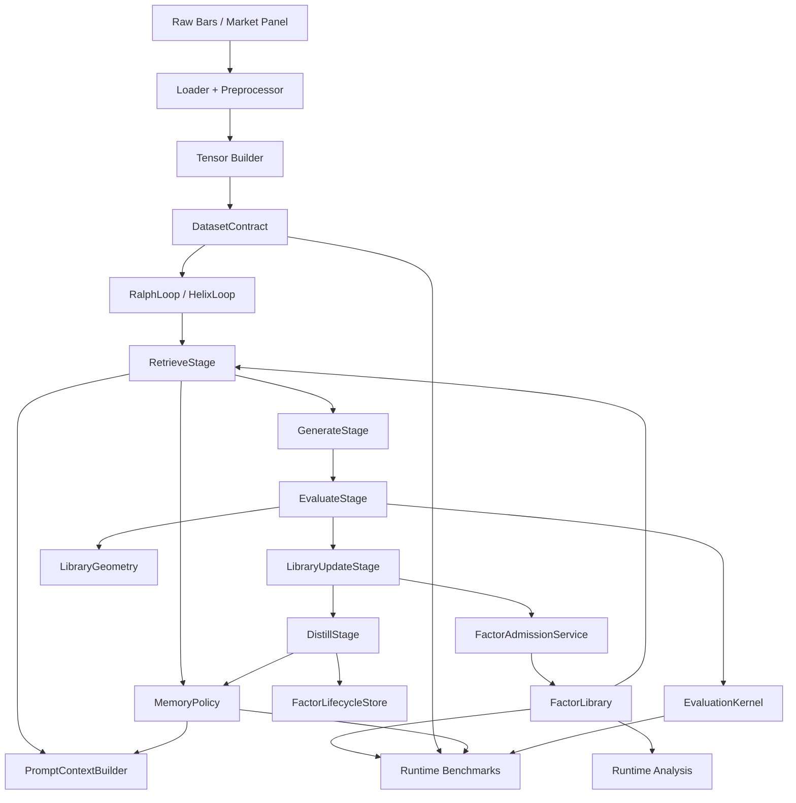
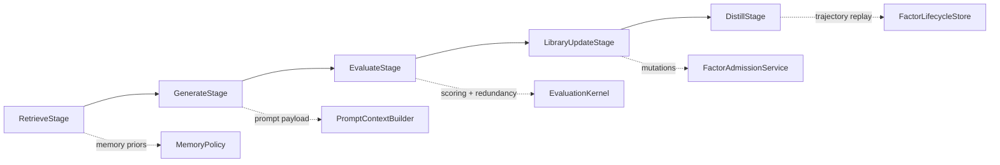
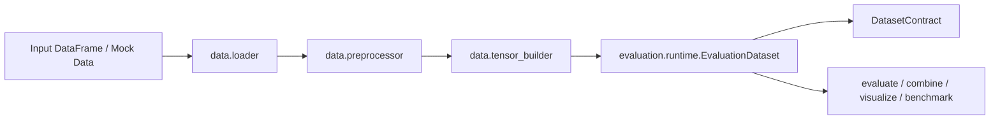
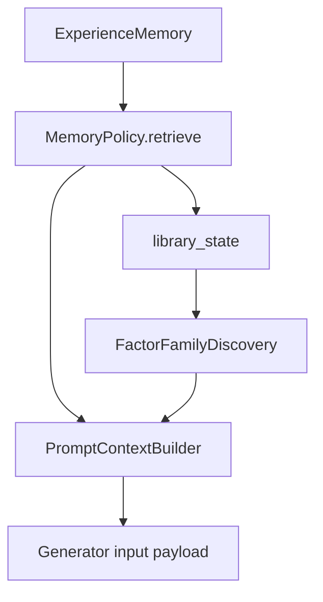
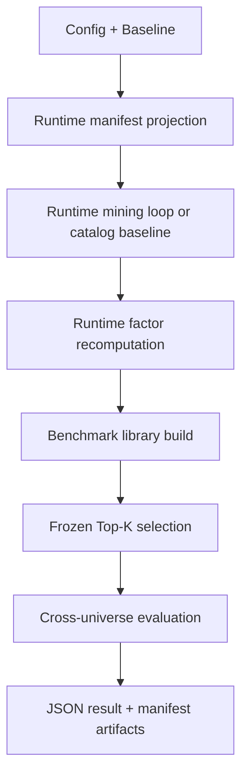

# FactorMiner Architecture

This document describes the current canonical architecture of the repository after the protocol, stage, memory-policy, dependence-metric, and benchmark-runtime refactors.

For a repo-wide inventory and implementation audit, see [Repo Audit](repo-audit.md).

## Canonical Contracts

The repository now has explicit architecture boundaries under `factorminer/architecture/`.

| Surface | Module | Responsibility |
| --- | --- | --- |
| Paper contract | `paper_protocol.py` | benchmark mode, targets, admission thresholds, replacement rules, Top-K freeze semantics, runtime artifact contract |
| Dataset contract | `dataset_contract.py` | shape metadata, target stack, default target, split-aware runtime dataset description |
| Dependence metrics | `dependence.py` | pluggable redundancy metrics: `spearman`, `pearson`, `distance_correlation` |
| Evaluation kernel | `evaluation_kernel.py` | candidate scoring, redundancy/replacement checks, geometry-aware evaluation rules |
| Geometry | `geometry.py` | library saturation, replacement eligibility, dependence snapshots |
| Memory policy | `memory_policy.py` | retrieval, formation, evolution, serialization, restoration |
| Family discovery | `families.py` | formula-family inference, saturation/gap diagnostics, prompt-facing family summaries |
| Prompt context | `prompt_context.py` | structured memory and family signal to generation payload |
| Lifecycle ledger | `lifecycle.py` | candidate trajectory capture across proposal, rejection, admission, and distillation |
| Stage model | `stages.py` | pluggable retrieve/generate/evaluate/update/distill stage interfaces |
| Library services | `library_services.py` | factor admission and replacement mutation logic |
| Phase 2 services | `phase2_services.py` | reusable online forgetting and knowledge-graph update logic |

## End-to-End Execution Graph

## Loop Architecture

Both mining loops share the same stage contract.

### Ralph loop

`RalphLoop` is the paper-faithful mining lane. Its responsibilities are now:

- instantiate canonical architecture services
- orchestrate stage execution
- own run/session/report lifecycle
- delegate retrieval, prompt construction, evaluation, admission, and memory evolution to services

### Helix loop

`HelixLoop` extends Ralph by swapping stage implementations while preserving the same outer pipeline:

- richer retrieval when KG or embeddings are enabled
- debate-based or standard proposal
- canonicalization and semantic deduplication before evaluation
- optional Phase 2 validation after admission
- KG updates, embedding updates, and online forgetting during distillation

### Stage sequence

## Data and Runtime Contracts

The benchmark and analysis surfaces no longer trust stored factor summaries as authoritative. They recompute factor signals on the supplied dataset.

### Data path

### Split semantics

The following paths use the runtime split definition derived from config:

- `evaluate`
- `combine`
- `visualize`
- `benchmark.runtime`

The authoritative split boundaries come from `data.train_period` and `data.test_period`.

## Memory System

The memory system is now a formal policy boundary rather than loop-local heuristics.

### Policy interface

Every `MemoryPolicy` owns:

- schema declaration
- retrieval contract
- formation contract
- evolution contract
- persistence contract
- restoration contract

### Current policies

| Policy | Purpose | Distinguishing behavior |
| --- | --- | --- |
| `paper` | paper-faithful default | uses flat experience memory and F/E/R operators |
| `none` | ablation | disables retrieval and distillation effects |
| `kg` | structure-aware retrieval | persists and queries a factor knowledge graph |
| `family_aware` | family-saturation steering | reranks retrieval by family gaps and saturated families |
| `regime_aware` | market-state steering | conditions retrieval context on detected active regime |

### Memory to prompt path

## Dependence Metrics and Library Geometry

Redundancy is no longer hardcoded to one metric. The architecture exposes explicit dependence metrics:

- `spearman`
- `pearson`
- `distance_correlation`

These are used across:

- library admission
- replacement checks
- candidate/library redundancy evaluation
- library serialization metadata
- runtime benchmark ablations

`LibraryGeometry` centralizes:

- current saturation snapshots
- candidate-to-library dependence summaries
- replacement eligibility
- geometry metadata for the evaluation kernel

## Family Discovery

`FactorFamilyDiscovery` derives prompt-facing family context from formulas and library state.

Current heuristics infer families from operator and feature patterns, including:

- `Momentum`
- `Smoothing`
- `Regression`
- `VWAP`
- `Amount`
- `Volatility`
- `Cross-Sectional`
- `Regime-Conditional`
- `PV-Correlation`
- `Higher-Moment`

This family layer is used by:

- `FamilyAwareMemoryPolicy`
- `PromptContextBuilder`
- category inference for newly admitted factors
- documentation and audit-level library diagnostics

## Benchmark Runtime

`factorminer.benchmark.runtime` is the canonical benchmark surface.

### Runtime benchmark graph

### Implemented benchmark lanes

| Function | Purpose |
| --- | --- |
| `run_table1_benchmark` | strict Top-K freeze evaluation across universes |
| `run_ablation_memory_benchmark` | compare default lane to no-memory lane |
| `run_ablation_strategy_benchmark` | compare `memory policy × dependence metric × backend` |
| `run_cost_pressure_benchmark` | transaction-cost stress analysis |
| `run_efficiency_benchmark` | operator and factor runtime benchmarking |
| `run_benchmark_suite` | canonical bundle runner |

### Benchmark backends

| Backend | Meaning |
| --- | --- |
| `numpy` | portable CPU execution |
| `c` | Bottleneck-backed compiled CPU kernels |
| `gpu` | torch-backed GPU execution |

## Persistence and Artifacts

### Loop/session persistence

Ralph and Helix persist:

- factor library metadata
- optional signal cache
- memory payload
- loop state
- run manifest
- session metadata

Checkpointing now respects policy-specific memory serialization rather than assuming one flat memory payload shape.

### Runtime artifacts

`output/` is treated as mutable runtime state. It is ignored by git and should not be considered source-controlled project content.

## Repo Boundaries

The intended ownership model is:

| Package | Primary role |
| --- | --- |
| `agent` | provider interfaces, prompt generation, debate |
| `architecture` | canonical contracts, services, policies |
| `benchmark` | canonical runtime benchmarking and legacy comparison helpers |
| `core` | loops, factor library, parser, expression tree, I/O |
| `data` | ingestion and tensor shaping |
| `evaluation` | metrics, recomputation, analysis, validation |
| `memory` | raw memory store, retrieval logic, KG, embeddings |
| `operators` | operator specs and execution backends |
| `utils` | config, reporting, plotting, helper glue |

## Current Strengths

- stage-composed loops instead of monolithic orchestration only
- explicit paper contract and runtime dataset contract
- policy-based memory system
- pluggable dependence metrics
- benchmark runtime as a single canonical surface
- full regression coverage across architecture, loops, benchmarks, and analysis

## Current Technical Debt

The architecture is materially cleaner, but some debt remains:

- `core/helix_loop.py` is still large and still owns several optional-feature concerns
- legacy benchmark/reporting surfaces still exist beside the canonical runtime path
- family discovery is heuristic, not learned
- memory-manager legacy paths still exist alongside policy-managed persistence
- NaN-window warnings in expression-tree execution remain unresolved

## Contributor Rules

When adding new behavior:

1. Put benchmark-facing semantics on `PaperProtocol`.
2. Put reusable scoring or geometry logic on `EvaluationKernel` or `LibraryGeometry`.
3. Put retrieval/evolution behavior behind `MemoryPolicy`.
4. Prefer a new service or stage implementation over growing Ralph/Helix directly.
5. Keep runtime artifacts and manifests machine-readable.
6. Add tests in `factorminer/tests` for every new contract surface.
