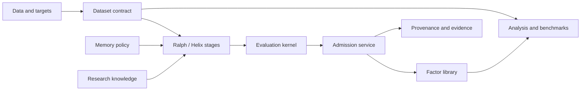

# Architecture

FactorMiner separates experiment policy, execution, admission, and persistence.
Ralph, Helix, the CLI, and MCP share engine contracts. Metric semantics are in
[reproducibility](reproducibility.md); trust boundaries are in [security](security.md).

## Execution

```mermaid
flowchart LR
    D[Data and targets] --> C[Dataset contract]
    C --> L[Ralph / Helix stages]
    M[Memory policy] --> L
    K[Research knowledge] --> L
    L --> E[Evaluation kernel]
    E --> A[Admission service]
    A --> F[Factor library]
    A --> P[Provenance and evidence]
    F --> R[Analysis and benchmarks]
    C --> R
```

`Config` supplies validated hierarchical settings. `MiningRunContext` holds
execution-specific paths and target panels; loops read these through
`MiningSettings`. DataFrames use `load_runtime_dataset`; aligned arrays use
`build_runtime_dataset_from_arrays`.

`FactorGenerator` parses and validates proposals. `LoopExecutionService` runs
named stages over `IterationPayload`. Both loops construct the same generator,
`MemoryPolicy`, artifact service, and research knowledge store. Helix replaces
selected stages and adds retrieval, debate, canonicalization, or validation.

`EvaluationKernel` recomputes signals on the supplied dataset.
`LibraryGeometry` summarizes dependence and saturation; `FactorAdmissionService`
owns candidate admission and replacement, including cross-island migrants.
Saved factor scores are metadata, never substitutes for evaluation.

## Ownership

| Package | Responsibility |
| --- | --- |
| `domain` | Dependency-free numerical contracts |
| `application` | Execution context, shared workflow services, artifacts |
| `architecture` | Protocols, policies, stages, generators, reusable research contracts |
| `core` | Loops, DSL parser, expression trees, factor library, session I/O |
| `agent` | Model providers, prompts, proposal generation, debate |
| `data` | Acquisition, normalization, feature attachment, tensor construction |
| `evaluation` | Signal execution, metrics, diagnostics, admission evidence, reports |
| `benchmark` | Frozen comparisons, datasets, statistics, provenance, reporting |
| `memory` | Stores, knowledge graphs, retrieval primitives, embeddings |
| `operators` | Typed operator definitions and backends |
| `mcp` | External tools/resources over engine workflows |

`integrations/` contains agent packaging; `scripts/` contains repository checks,
demos, and the standalone benchmark entry point. Neither owns a second engine.

Domain modules cannot import higher layers. Adapter modules cannot import
application/interfaces, and application modules cannot import CLI, MCP, or
benchmark interfaces. `scripts/check_architecture.py` enforces these boundaries;
package exports are lazy and covered by import tests.

## Data and formulas

The runtime normalizes panels into `EvaluationDataset` and `DatasetContract`.
Configured target definitions and train/test periods are shared by mining,
`evaluate`, `combine`, `visualize`, and benchmark workflows.

Registered leaves include `$open`, `$high`, `$low`, `$close`, `$volume`, `$amt`,
`$vwap`, and `$returns`. Scoped feature registrations can add point-in-time
fundamentals or futures fields. The parser builds expression trees executed by
registered operators on NumPy, C, or GPU backends.

## Memory and research knowledge

`MemoryPolicy` owns schema, retrieval, formation, evolution, serialization, and
restoration. Available policies are `paper` (flat experience), `none`, `kg`,
`family_aware`, `regime_aware`, and `edit_aware`. Prompt construction uses typed
summaries; edit-aware memory receives actual parent and secondary-parent lineage.

`ResearchKnowledgeStore` separately records source decisions, structured
hypotheses, and candidate outcomes under `output/research_knowledge/`. Retrieval
uses admission yield and uncovered families, bounded by
`research.knowledge_retrieval_limit`. Source and hypothesis IDs propagate into
factor provenance and evidence packs.

With `research.planner.enabled`, the shared execution service selects generation,
refinement, advisory delay challenge, or stop after retrieval. Generation and
refinement use the normal evaluator and admission service. Challenges recompute
signals without modifying admission. See [research actions](research-actions.md).

With `research.skills.enabled`, `TransferableSkillMemoryPolicy` wraps the
configured policy and owns frozen procedure retrieval and local contradiction
review. The action service selects a kind, asks memory for a recipe, logs the
joint probability, and returns committed outcomes. Pack hashes and retrieval
settings are pinned in campaign identity. See [research skills](research-skills.md).

## Analysis and benchmarks

Analysis recomputes formulas on the requested panel and split. Dependence
strategies are explicit: `spearman`, `pearson`, or `distance_correlation`.
Optional diagnostics include significance, CPCV/PBO, decay, causal checks,
crowding, capacity, portfolios, sensitivity, and model-risk evidence.

`benchmark.runtime` coordinates comparisons. Separate modules own contracts,
provenance, datasets, mining-loop construction, frozen evaluation, statistics,
speed measurements, and reports. The CLI and `scripts/run_phase2_benchmark.py`
delegate to these services. Benchmarks include frozen Top-K evaluation,
component/strategy ablations, cost pressure, CPCV, and procedure-transfer tests.

## Persistence

Sessions persist library, memory, loop state, manifests, lifecycle/trial ledgers,
evidence, and optional signal caches. Restoration is policy-specific.

The action ledger commits each terminal outcome and its latest recovery snapshot
in one SQLite transaction. It can repair missing/torn checkpoint files. In-flight
work without a committed result is marked interrupted; campaigns require one
writer and stable dataset/protocol identity. Auxiliary stores retain their own
persistence contracts.

`EvidencePack` binds formula AST, lineage, split metrics, failure evidence,
admission decisions, source attribution, attestations, and data/config/code
hashes. Its content-derived ID supports `factorminer verify-evidence` integrity
checks. A valid hash does not establish data truth or statistical validity.
`output/` remains mutable local state; retain manifests with archived campaigns.
