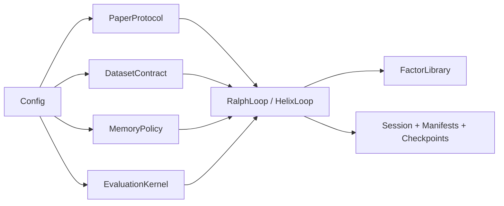
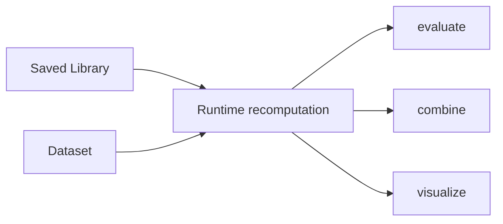
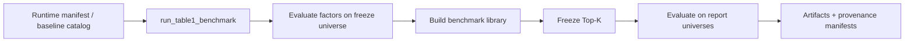

# FactorMiner Repo Audit

This document is a technical audit of the current repository state after the architecture and runtime benchmark refactors.

## Snapshot

Audit-time snapshot:

- `119` Python files under `factorminer/`
- `46,736` lines of Python
- `27` test modules
- `441` passing tests
- `70` registered operators
- `110` built-in paper factors

Package inventory:

| Package | Python files | Role |
| --- | ---: | --- |
| `agent` | 8 | providers, prompting, debate |
| `architecture` | 13 | canonical contracts, policies, stages, services |
| `benchmark` | 5 | runtime benchmark suite and legacy benchmark helpers |
| `core` | 12 | loops, factor library, parser, expression tree, I/O |
| `data` | 5 | loading, preprocessing, tensorization, mock generation |
| `evaluation` | 16 | metrics, recomputation, validation, portfolio analysis |
| `memory` | 10 | memory store, retrieval, KG, embeddings |
| `operators` | 14 | operator implementations and backends |
| `tests` | 27 | regression coverage |
| `utils` | 6 | config, reporting, plotting |

## What Is Structurally Strong

### Canonical architecture layer exists now

The largest structural improvement is the existence of a real `factorminer.architecture` package. The codebase now has explicit surfaces for:

- protocol
- dataset contract
- dependence metrics
- evaluation kernel
- memory policy
- family discovery
- prompt context
- stage model
- admission service
- lifecycle logging
- Phase 2 helper services

That is a substantial improvement over the earlier state where semantics were spread across Ralph, Helix, benchmark code, and config projections.

### Runtime benchmark surface is the correct productized path

`factorminer.benchmark.runtime` is now the right center of gravity. It owns:

- dataset loading
- runtime mining loop execution
- benchmark library build
- frozen Top-K selection
- cross-universe evaluation
- manifest and provenance capture
- runtime ablations

This is the correct direction. The old benchmark layer still exists, but it is no longer the best architectural path.

### The test surface is strong

The repo has broad regression coverage. This matters because the codebase is no longer a small research prototype. It now behaves like a maintainable framework with multiple contracts and execution lanes.

## Canonical Execution Paths

### Mining path

### Analysis path

### Benchmark path

## Findings By Area

### 1. `architecture/`

Status: strong.

This package now contains the right kinds of abstractions. It meaningfully reduces conceptual duplication and gives the rest of the repo a place to grow without bloating the loops further.

Most valuable modules:

- `paper_protocol.py`
- `dataset_contract.py`
- `evaluation_kernel.py`
- `memory_policy.py`
- `families.py`
- `stages.py`

Main remaining gap:

- the architecture layer exists, but not every older concern has been moved into it yet

### 2. `core/`

Status: improved but still the largest debt surface.

`RalphLoop` is better than before because it now composes stages and delegates more work. `HelixLoop` is still structurally heavy. It still owns many optional features and phase-specific concerns in one file.

Main hotspots:

- `core/helix_loop.py`
- `core/ralph_loop.py`
- `core/expression_tree.py`

What improved:

- library mutation logic moved toward a service
- memory persistence is policy-aware
- family/category inference is no longer purely ad hoc

What still needs work:

- more Helix feature logic should move into policies/services
- expression-tree warning behavior should be made explicit and quieter

### 3. `benchmark/`

Status: good direction, not fully cleaned.

`benchmark/runtime.py` is clearly the canonical path now. It supports:

- real runtime loop execution
- memory ablation
- strategy-grid ablation
- cost-pressure analysis
- efficiency benchmarking

Remaining issue:

- `benchmark/helix_benchmark.py` and `run_phase2_benchmark.py` still exist as legacy-facing surfaces

Recommendation:

- either fully document them as legacy analysis/reporting tools or continue collapsing their useful pieces into `benchmark/runtime.py`

### 4. `memory/`

Status: solid base, promising extension surface.

The repo now has a real policy boundary over the raw memory components. That is the right abstraction. The next gains will come from richer concrete policies rather than more loop-local heuristics.

Current state:

- flat memory retrieval exists
- KG retrieval exists
- regime-aware retrieval exists
- family-aware retrieval exists

Most valuable next steps:

- learned family discovery instead of heuristic family inference
- tighter integration between policy-level persistence and any legacy memory-manager path

### 5. `evaluation/`

Status: broad and important.

This package is doing a lot:

- runtime recomputation
- metrics
- portfolio combination
- regime/capacity/causal/significance validation

This is both a strength and a future refactor target. The benchmark/runtime layer currently relies heavily on this package, which is correct, but there is still conceptual spread between evaluation kernel logic and the wider evaluation package.

### 6. `operators/`

Status: materially better after the backend work.

The repo now has a real `c` backend contract via Bottleneck-backed compiled CPU operations. That closes one of the bigger credibility gaps between paper claims and implementation reality.

Remaining concern:

- backend availability and numerical equivalence should continue to be treated as test-critical surfaces

## Documentation Findings

Before this audit pass, the markdown surface was behind the code in several ways:

- missing the new `architecture/` package from the repo story
- under-documenting the benchmark runtime surface
- missing the strategy-grid ablation lane
- not describing policy-based memory or family discovery adequately
- not showing the new loop/stage model clearly

This audit pass updates:

- `README.md`
- `docs/architecture.md`
- `docs/repo-audit.md`

## Repository Health Risks

### Medium-risk structural issues

- `HelixLoop` still concentrates many optional concerns in one file
- legacy benchmark/reporting surfaces still coexist with the canonical path
- some config projection logic still exists in multiple places

### Medium-risk product issues

- documentation can drift again if architecture changes are not reflected in the docs layer
- heuristic family inference is useful but not yet a robust research surface

### Low-risk but noisy issues

- NaN-window runtime warnings in expression-tree execution
- style debt in some older loop code

## Recommended Next Implementation Order

If continuing from the current state, the best next order is:

1. Continue shrinking `core/helix_loop.py` into policies and services.
2. Resolve the legacy benchmark split by moving more reporting concerns to the runtime suite.
3. Add learned or cluster-based factor-family discovery.
4. Make policy-level experiment manifests richer and easier to compare across runs.
5. Address the expression-tree warning surface explicitly.

## Recommended GitHub Docs Surface

The best public-facing docs structure for the repo now is:

- `README.md`: project entry point, architecture summary, quick start, benchmark surface
- `docs/architecture.md`: technical architecture and runtime contract
- `docs/repo-audit.md`: implementation inventory, strengths, debt, roadmap

That is enough structure for a serious GitHub repo without overbuilding a docs system too early.

## Bottom Line

The repo is no longer just a paper prototype. It now has:

- a canonical architecture layer
- a canonical benchmark-runtime surface
- stage-composed loops
- policy-based memory
- pluggable dependence metrics
- stronger reproducibility and artifact semantics

The next challenge is not invention of more surfaces. It is disciplined consolidation of the remaining heavy modules around the architecture layer that now exists.
