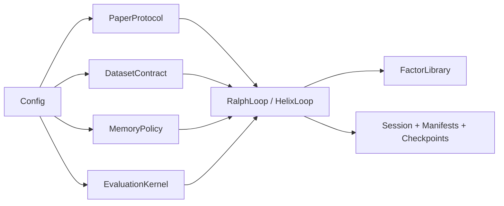
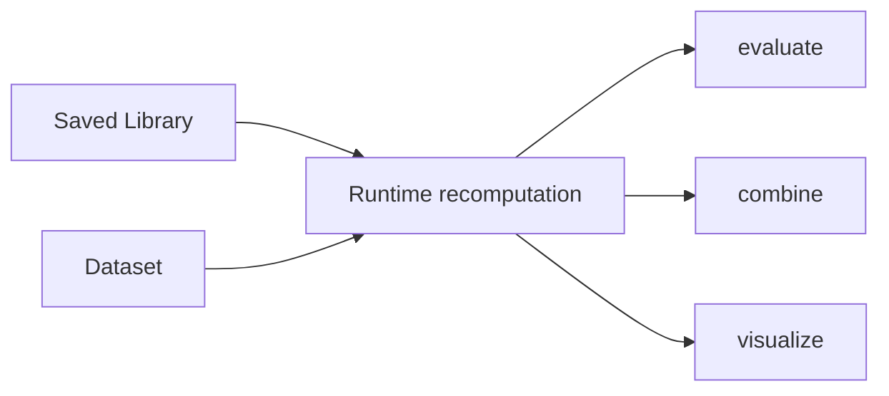
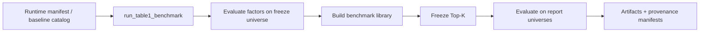

# FactorMiner Repo Audit

This document is a technical audit of the current repository state after the
architecture, research-extension, correctness, and consolidation passes.

## Snapshot

This audit intentionally avoids hardcoded fast-moving repository counts. For a
fresh local snapshot, run:

```bash
uv run pytest --collect-only -q factorminer/tests
uv run python - <<'PY'
from pathlib import Path
files = sorted(Path("factorminer").rglob("*.py"))
lines = sum(p.read_text(errors="ignore").count("\n") + 1 for p in files)
print(f"Python files: {len(files)}")
print(f"Python lines: {lines}")
PY
```

Stable paper-facing inventory:

- `110` built-in paper factors
- canonical paper-style and research mining lanes
- runtime recomputation for analysis and benchmark reporting

Package inventory (verified fresh for this pass — `architecture`, `data`,
`evaluation`, `memory`, `tests` grew further since the previous audit
update; see [Landscape Review & Extension Roadmap](landscape-and-extensions.md)
§10 for the 17-item round that drove most of this growth, and the chat
history of the subsequent deep-audit + research pass for the 12 bug fixes
and 4 methodology closures layered on top):

| Package | Python files | Role |
| --- | ---: | --- |
| `agent` | 8 | providers, prompting, debate, prompt caching, cascade routing |
| `architecture` | 21 | canonical contracts, policies, stages, services, sealed search, island model |
| `benchmark` | 5 | canonical runtime benchmark suite (`runtime.py`, 3,097 lines including report contracts) plus a 46-line deprecated import shim |
| `configs` | 1 | packaged YAML profile resources |
| `core` | 13 | loops, factor library, parser, expression tree, I/O, provenance |
| `data` | 10 | loading, preprocessing, tensorization, mock generation, Qlib/MCP/EDGAR/futures sources |
| `evaluation` | 24 | metrics, recomputation, validation, portfolio/risk/capacity/crowding analysis, model zoo |
| `mcp` | 2 | FactorMiner-as-MCP-server surface (authenticated HTTP + stdio) |
| `memory` | 10 | memory store, retrieval (BM25+dense hybrid), KG, embeddings, and a frozen `ExperienceMemoryManager` compatibility facade; loops use policy persistence |
| `operators` | 15 | operator implementations, backends, and sandboxing |
| `tests` | 63 | regression coverage (855 collected tests) |
| `utils` | 6 | config, reporting, plotting |

## What Is Structurally Strong

### Canonical architecture layer exists now

The largest structural improvement is the existence of a real `factorminer.architecture` package. The codebase now has explicit surfaces for:

- protocol
- dataset contract
- dependence metrics
- evaluation kernel
- memory policy
- family discovery
- prompt context
- stage model
- admission service
- lifecycle logging
- Phase 2 helper services

That is a substantial improvement over the earlier state where semantics were spread across Ralph, Helix, benchmark code, and config projections.

### Runtime benchmark surface is the correct productized path

`factorminer.benchmark.runtime` is now the right center of gravity. It owns:

- dataset loading
- runtime mining loop execution
- benchmark library build
- frozen Top-K selection
- cross-universe evaluation
- manifest and provenance capture
- runtime ablations

The old `helix_benchmark` implementation no longer exists as an execution
path. Its module is a 46-line compatibility shim whose symbols resolve to
`benchmark.runtime`.

### The test surface is strong

The repo has broad regression coverage. This matters because the codebase is no longer a small research prototype. It now behaves like a maintainable framework with multiple contracts and execution lanes.

The CI surface now checks Ruff, tests, package artifact contents, import boundaries, and a CPU-safe CLI smoke that fails when `factor_library.json` is empty.

## Canonical Execution Paths

### Mining path



### Analysis path



### Benchmark path



## Findings By Area

### 1. `architecture/`

Status: strong.

This package now contains the right kinds of abstractions. It meaningfully reduces conceptual duplication and gives the rest of the repo a place to grow without bloating the loops further.

Most valuable modules:

- `paper_protocol.py`
- `dataset_contract.py`
- `evaluation_kernel.py`
- `memory_policy.py`
- `families.py`
- `stages.py`

Main remaining gap:

- the architecture layer exists, but not every older concern has been moved into it yet

### 2. `core/`

Status: improved, still the largest debt surface.

`RalphLoop` is better than before because it now composes stages and delegates more work. `HelixLoop` is still structurally heavy. It still owns many optional features and phase-specific concerns in one file.

Main hotspots:

- `core/helix_loop.py`
- `core/ralph_loop.py`
- `core/expression_tree.py`

What improved:

- library mutation logic moved toward a service
- memory persistence is policy-aware
- family/category inference is no longer purely ad hoc

What still needs work:

- more Helix validation, auto-invention, and checkpoint logic should move into
  policies/services
- `HelixLoop` is smaller (1,490 to 1,270 lines) but remains large

### 3. `benchmark/`

Status: consolidated.

`benchmark/runtime.py` is clearly the canonical path now. It supports:

- real runtime loop execution
- memory ablation
- strategy-grid ablation
- cost-pressure analysis
- efficiency benchmarking

Current state:

- `benchmark/helix_benchmark.py` is import-only and emits a deprecation warning
- `run_phase2_benchmark.py` delegates comparison and ablation execution to
  `benchmark.runtime`
- causal and canonicalization ablation variants are projected by the same
  canonical runtime configuration path as other Phase-2 variants

### 4. `memory/`

Status: solid base, promising extension surface.

The repo now has a real policy boundary over the raw memory components. That is the right abstraction. The next gains will come from richer concrete policies rather than more loop-local heuristics.

Current state:

- flat memory retrieval exists
- KG retrieval exists
- regime-aware retrieval exists
- family-aware retrieval exists
- `SuccessPattern.confidence` is backward-compatible for older memory JSON
- online regime forgetting now applies deterministic confidence decay and uses `RegimeState.label()` semantics

Most valuable next steps:

- learned family discovery instead of heuristic family inference
- remove the frozen `ExperienceMemoryManager` compatibility facade after its
  deprecation window; production loops already use policy serialization

### 5. `evaluation/`

Status: broad and important.

This package is doing a lot:

- runtime recomputation
- metrics
- portfolio combination
- regime/capacity/causal/significance validation

This is both a strength and a future refactor target. The benchmark/runtime layer currently relies heavily on this package, which is correct, but there is still conceptual spread between evaluation kernel logic and the wider evaluation package.

### 6. `operators/`

Status: materially better after the backend and sandbox work.

The repo now has a real `c` backend contract via Bottleneck-backed compiled CPU operations. That closes one of the bigger credibility gaps between paper claims and implementation reality.

Remaining concern:

- backend availability and numerical equivalence should continue to be treated as test-critical surfaces
- custom operator code paths now share one NumPy-only sandbox, but this should continue to be treated as a security-sensitive surface

### 7. Packaging and first-run UX

Status: materially improved.

Fixed in this stabilization pass:

- packaged distributions include `factorminer/configs/default.yaml`
- packaged distributions exclude `factorminer.tests*`
- default backend is CPU-safe `numpy`
- `--gpu/--cpu` are explicit overrides instead of forcing GPU by default
- `factorminer doctor` checks install/config/dependency/key/path readiness
- `factorminer init-config` writes a mock-friendly starter YAML
- `factorminer quickstart` runs doctor, mines a tiny mock library, and writes a static report
- `factorminer session inspect` summarizes run artifacts and warns on library-size mismatches
- paper-mode quality gates now use `ic_paper_mean = abs(mean(IC_t))`; legacy
  `ic_abs_mean = mean(abs(IC_t))` remains diagnostic only

Deferred:

- full-repo mypy remains non-blocking; scoped type-health checks are documented instead

## Documentation Findings

Before this audit pass, the markdown surface was behind the code in several ways:

- missing the new `architecture/` package from the repo story
- under-documenting the benchmark runtime surface
- missing the strategy-grid ablation lane
- not describing policy-based memory or family discovery adequately
- not showing the new loop/stage model clearly

This audit pass updates:

- `README.md`
- `docs/architecture.md`
- `docs/repo-audit.md`
- `docs/metrics.md`
- `docs/faq.md`
- `docs/reproducibility.md`

## Repository Health Risks

### Branch integration remains external coordination

The original 107-file working tree is committed and pushed as `5fd351d`,
followed by bounded consolidation commits for generation/memory
(`2f509aa`), benchmark execution (`673a024`), Helix component construction
(`af5f22d`), and NaN handling (`751c027`). Local verification covers Ruff,
manifest/plugin checks, package artifacts, and the full pytest surface. The
final integrated run reports `855 passed, 10 warnings`; none of those warnings
come from the expression-tree surface addressed by this roadmap.

The remaining integration step is to merge the tracked feature branch,
observe hosted CI, and close issue #5. This is no longer a source-loss risk,
but main-branch health still depends on that repository workflow completing.

### Resolved structural risks

- `RalphLoop` has no private generator class; both loops use
  `agent.factor_generator.FactorGenerator` and the shared validated parser,
  so caching, cascade routing, and repair apply to both
- both loops serialize and restore memory through `MemoryPolicy`;
  `ExperienceMemoryManager` is explicitly frozen and has no production-loop
  call site
- `helix_benchmark.py` is a 46-line import shim, not a second benchmark
  engine; Phase-2 comparison/ablation execution is runtime-owned
- all-NaN rolling/cross-sectional reductions are guarded explicitly, and the
  expression/Ralph/island focused suite emits no project RuntimeWarnings

### Remaining medium-risk structural issues

- `HelixLoop` remains 1,270 lines after a 220-line reduction; validation,
  auto-invention, and Phase-2 checkpoint persistence are the next coherent
  extraction seams
- compatibility shims (`helix_benchmark.py`, `ExperienceMemoryManager`) need
  a deprecation window plus downstream call-site audit before deletion
- some config projection logic still exists in multiple places
- full-repo mypy debt is visible but not yet suitable as a blocking CI gate

### Medium-risk product issues

- documentation can drift again if architecture changes are not reflected
  in the docs layer (this pass re-synced `README.md`, `docs/architecture.md`,
  `docs/landscape-and-extensions.md`, and added `docs/security.md`)
- heuristic family inference is useful but not yet a robust research surface

### Low-risk but noisy issues

- `evaluation/portfolio.py` emits empty-quintile `nanmean` warnings in one
  tiny benchmark fixture; these are now visible after the expression-tree
  warning surface was removed
- style debt in some older loop code

## Recommended Next Implementation Order

If continuing from the current state, the best next order is:

1. Merge the pushed consolidation branch, confirm hosted CI, and close issue
   #5 with the financial-services integration document linked.
2. Continue shrinking `core/helix_loop.py`, beginning with validation or
   checkpoint persistence rather than another mixed extraction.
3. Quiet the remaining portfolio empty-quintile warnings.
4. Remove compatibility shims after the deprecation window.
5. Add learned or cluster-based factor-family discovery.
6. Expand scoped mypy cleanup, anchored on round-2's already-typed
   `@dataclass(frozen=True)` contracts, before considering a blocking type
   gate.

Deliberately **not** next: another landscape/feature-extension round. Round
2 alone introduced 12 real bugs found by one dedicated audit pass; the
newest surfaces (crowding, sealed search, capacity/risk modeling) should
accumulate real usage and test coverage before a round 3 adds a further
layer on top.

## Recommended GitHub Docs Surface

The best public-facing docs structure for the repo now is:

- `README.md`: project entry point, architecture summary, quick start, benchmark surface
- `docs/metrics.md`: IC semantics and compatibility details
- `docs/faq.md`: answers to setup, data, model, and API-key confusion
- `docs/reproducibility.md`: mock versus private-data reproduction paths
- `docs/architecture.md`: technical architecture and runtime contract
- `docs/security.md`: threat model for every externally-facing surface
  (data connectors, MCP transport, local-LLM providers, LLM-authored report
  content)
- `docs/landscape-and-extensions.md`: full extension roadmap and
  implementation-status evidence for every landscape item
- `docs/repo-audit.md`: implementation inventory, strengths, debt, roadmap

That is enough structure for a serious GitHub repo without overbuilding a docs system too early.

## Bottom Line

The repo is no longer just a paper prototype. It now has:

- a canonical architecture layer
- one canonical benchmark execution surface; the old module is import-only
- stage-composed loops sharing one validated factor generator
- policy-based memory persistence on both Ralph and Helix
- service-owned optional Phase-2 component construction
- pluggable dependence metrics
- stronger reproducibility and artifact semantics
- a materially expanded, audited research surface: crowding/risk/portfolio
  evaluation, MCP-server hardening, prompt caching and cascade routing,
  sealed multi-evaluator search, EDGAR/futures data connectors — see
  [Landscape Review & Extension Roadmap](landscape-and-extensions.md)

The next challenge is still not invention of more surfaces. It is, in
order: getting the existing work committed and reviewable at all, then
disciplined consolidation of the remaining heavy modules — most urgently
the `RalphLoop`/`HelixLoop` infrastructure fork — around the architecture
layer that now exists.
