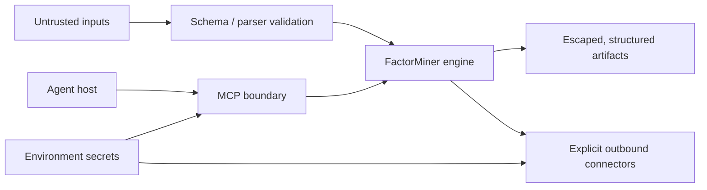

# Security Model

FactorMiner processes untrusted market data and model-generated text, launches
bounded subprocesses, can call external data services, and can expose an MCP
tool surface. This document defines the current trust boundaries and enforced
controls for those operations.

FactorMiner is a research engine. Its tools return research artifacts; they do
not place trades, size positions, bind limits, route orders, or operate accounts.

## Assets and trust boundaries

Protected assets include provider credentials, MCP bearer tokens, licensed
market data, local files outside selected input/output paths, research artifacts,
and the integrity of evaluation results.

Treat all of the following as untrusted data:

- CSV, Parquet, HDF, Qlib, and connector payloads;
- saved factor libraries and session artifacts;
- formulas, rationales, research notes, and all LLM output;
- MCP tool arguments and external agent handoffs;
- remote HTTP responses and local OpenAI-compatible endpoints.

The primary boundaries are:



## Filesystem and subprocess execution

MCP engine tools delegate to the `factorminer` CLI using explicit argument
arrays. They do not use `shell=True`. The called workflow receives explicit
input/output paths and returns captured structured output or an error containing
the return code and diagnostics.

`output/` is mutable local state and is ignored by Git. Agent manifests confine
managed output to `./out/`; only the librarian leaf in the reference managed
integration has write-capable tools. Plugin and managed-agent references are
validated by `scripts/check.py`.

Input path validation is format-specific. Connector cache keys use normalized,
validated identifiers rather than response-controlled path fragments. Data
loaders do not execute file contents.

## Outbound data connectors

Current outbound surfaces are:

| Surface | Data | Invocation |
| --- | --- | --- |
| `data/edgar_source.py` | SEC EDGAR XBRL facts | explicit `attach-edgar` |
| `data/mcp_source.py` | configured external MCP table data | explicit `fetch-data` |
| `evaluation/crowding.py` | public consensus-factor return panels | explicit crowding workflow |
| `data/futures_source.py` | continuous-futures input transformation | explicit `build-futures` |

Network fetches use explicit timeouts. EDGAR access is pinned to
`https://data.sec.gov`, applies response-size limits, sends a descriptive user
agent, and rate-limits requests to the SEC fair-access ceiling. Point-in-time
joins use filing dates, not covered-period end dates, so facts are unavailable
before publication.

Consensus-factor fetches reject non-HTTPS URLs, enforce response-size caps, and
validate content/shape before parsing. Malformed or unavailable data produces an
explicit unavailable result rather than a low-risk default.

`MCPDataSourceConfig` is operator-controlled YAML. It validates transport,
required connection fields, canonical column coverage, positional schemas, and
unknown keys before opening a connection. `${ENV}` expansion allows credentials
to remain outside the file. Derived `amount = close * volume` is opt-in and is
recorded as an approximation, not observed turnover.

Normal `mine` and `helix` commands do not trigger unattended external fetches.
Acquisition and attachment are separate explicit workflows.

## MCP server

### Stdio

Stdio is the default transport. It is a local subprocess pipe and does not add a
network listener or application authentication layer:

```bash
uv run factorminer mcp-serve --transport stdio
```

The security boundary is the process launcher and host user account.

### HTTP

HTTP transport is opt-in. The default host is `127.0.0.1`, and startup fails
unless the configured token environment variable contains a non-empty value:

```bash
export FACTORMINER_MCP_TOKEN="$(openssl rand -hex 32)"
uv run factorminer mcp-serve \
  --transport http --host 127.0.0.1 --port 8765
```

Clients must send `Authorization: Bearer <token>`. Authentication uses the MCP
SDK `TokenVerifier`/`AccessToken` protocol via
`StaticBearerTokenVerifier`. There is no unauthenticated HTTP mode.

The static bearer token is a single-operator/trusted-network control. It does
not provide user identity, roles, tenant isolation, or per-tool authorization;
do not expose the development listener as a public multi-tenant service.

The separate `hosted-pilot serve` surface adds tenant-bound scoped credentials,
durable allow-listed jobs, quotas, retention, and consent controls. Its threat
model and operator runbook are in [Hosted pilot security and
operations](hosted-pilot.md). The local server and hosted server must never be
routed through the same public endpoint.

Every tool description states its argument/result shape and the research-only
contract. Tool functions return structured JSON and never invoke a trading or
broker endpoint. Deployment details are in the
[integration guide](../integrations/factor-researcher/README.md).

## Local/frontier model cascade

`OpenAICompatibleProvider` sends prompts to an operator-configured `base_url`.
That URL is loaded from local configuration and cannot be supplied by a formula,
LLM response, research note, or MCP request.

Enforced credential separation:

- a missing custom `base_url` is an error;
- the custom provider does not fall back to `OPENAI_API_KEY`;
- frontier-provider construction strips custom `base_url` values;
- local/draft and frontier requests have independent timeouts.

Enabling a custom endpoint grants that endpoint access to the prompt content
sent through the draft path. Operators must treat the endpoint as a data
processor and restrict it with normal network policy.

## Formula and generated-code boundary

The default factor surface is a typed DSL, not arbitrary Python. Output is
parsed into an expression tree, validated against registered leaves/operators,
and evaluated through bounded operator implementations. Parse failures and
unsupported expressions fail evaluation; the runtime does not substitute saved
scores.

LLM text is never passed to Python `eval` or `exec`. Connector and artifact
formats use JSON/YAML/tabular parsers with schema checks. Operator sandbox and
custom-operator paths must preserve the same resource and syntax restrictions.

## Prompt and memory injection

Research notes and model output can re-enter later model context only through
structured boundaries:

- research absorption emits bounded `ResearchArchetype` fields instead of
  concatenating raw documents into generation prompts;
- `PromptContextBuilder` renders typed memory/library summaries;
- sealed evaluator feedback allow-lists coarse fields and excludes raw evaluator
  internals from generator-facing context;
- malformed evaluator replies fail to a neutral/rejected result;
- economic rationale is attached to an admitted factor and is not treated as a
  system instruction.

These controls separate instructions from data structurally. Agent prompts must
continue to label connector payloads, notes, formulas, and saved artifacts as
data rather than instructions.

## HTML and report rendering

Formula names, rationales, narrative fields, and model-authored text are escaped
with `html.escape` before interpolation into HTML reports. An economic rationale
is marked `UNATTESTED -- LLM DRAFT, NOT REVIEWED` unless its attestation is
explicitly recorded as human.

Static report generation does not execute embedded model output. Regression
tests include literal script-tag payloads and assert escaped output.

## Evaluation integrity

Security includes protection against misleading research artifacts:

- runtime analysis recomputes formulas on the selected dataset;
- train/test boundaries are explicit and shared across analysis paths;
- point-in-time fundamental joins use availability dates;
- proxy and partial baselines are labeled in manifests;
- sealed multi-evaluator mode exposes agreement summaries rather than its
  scoring internals to generation;
- unavailable diagnostics remain unavailable rather than defaulting to a safe
  label.

These controls limit stale-score reuse, look-ahead, provenance ambiguity, and
reward gaming. They do not turn a backtest into an investment recommendation.

## Secrets and persistence

API keys and bearer tokens belong in environment variables or an approved
secret store. They must not appear in YAML committed to Git, CLI arguments that
are routinely logged, reports, session state, RFT JSONL, or benchmark manifests.

Current persistence surfaces store formulas, metrics, policies, trajectory
metadata, hashes, rewards, and configuration projections—not provider secrets.
The RFT export records `trains_model: false`; it creates a dataset and does not
launch model training.

## Model serialization

FactorMiner trains optional small models in process and does not call
`torch.load` on external checkpoints. Consequently the Python-pickle checkpoint
execution surface is absent from the current runtime. External serialized model
objects are not accepted as CLI/MCP inputs.

## Verification

The following checks enforce this document's key invariants:

| Control | Coverage |
| --- | --- |
| HTTP requires a token and defaults to loopback | MCP server tests |
| Tool descriptions retain research-only text | MCP tests and live stdio smoke in CI-compatible environments |
| Connector timeouts, caps, malformed input, and point-in-time joins | data/crowding regression tests |
| Custom provider does not read frontier credentials | LLM-interface tests |
| Sealed feedback excludes evaluator internals | sealed-search tests |
| HTML escapes model-authored fields | report/MRM tests |
| Integration files and relative references resolve | `uv run python scripts/check.py` |
| Package/import contracts remain stable | `test_import_boundaries.py` and CI |
