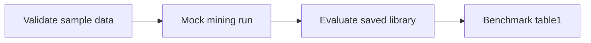

# Quickstart

This directory is a deterministic, self-contained walkthrough for the current CLI surface.

Use it when you want to understand the repo from the outside first:



## Files

- [sample_market_data.csv](sample_market_data.csv): tiny market-shaped CSV with canonical columns.
- [quickstart.yaml](quickstart.yaml): local config that aligns the sample CSV with evaluation and keeps the mock provider enabled.
- [validate-data.sh](validate-data.sh): local preflight validation helper.
- [run_mock_mining.sh](run_mock_mining.sh): deterministic mock mining walkthrough.
- [run_real_data_shape.sh](run_real_data_shape.sh): real-data-shaped mining walkthrough.
- [run_evaluation.sh](run_evaluation.sh): strict recomputation walkthrough.
- [run_benchmark.sh](run_benchmark.sh): short benchmark walkthrough.
- [expected/artifacts.md](expected/artifacts.md): what should appear in output directories.

## 1. Validate the data

The quickstart starts with the native schema preflight command:

```bash
bash validate-data.sh sample_market_data.csv
```

What it checks:

- required columns
- parseable datetimes
- positive numeric market fields
- asset/date coverage
- obvious schema mistakes

## 2. Run a mock mining pass

This uses generated mock data and writes outputs to `/tmp` by default.

```bash
bash run_mock_mining.sh
```

Expected result:

- a saved `factor_library.json`
- console output showing the library size and output path

## 3. Run a real-data-shaped pass

This uses the sample CSV with a local quickstart config that keeps the train/test window aligned and uses the mock LLM provider.

```bash
bash run_real_data_shape.sh
```

If you later want to try a live LLM-backed run, remove `--mock` in that script and provide the required API key in your shell environment.

## 4. Evaluate the saved library

```bash
bash run_evaluation.sh
```

This performs strict recomputation against the sample data and reports factor quality on the requested split.
If the quickstart mining run still yields an empty library, the helper exits early with a clear note instead of failing.

## 5. Run a short benchmark

```bash
bash run_benchmark.sh
```

This is a dry-run walkthrough for the canonical `benchmark table1` surface because the real table1 path intentionally builds a large mock panel. Run the live benchmark explicitly when you want the full path:

```bash
bash run_benchmark.sh --run /tmp/factorminer-quickstart-benchmark
```

## Common mistakes

- Pointing the CLI at a directory that does not contain `factor_library.json`.
- Forgetting `--mock` on a machine without LLM credentials.
- Using a CSV that renames canonical fields without one of the supported aliases.
- Expecting a tiny sample to produce a large factor library. Small smoke runs can be valid even when the admitted library stays empty.
- Writing outputs into the repo root instead of an ignored path like `/tmp/factorminer-quickstart`.
